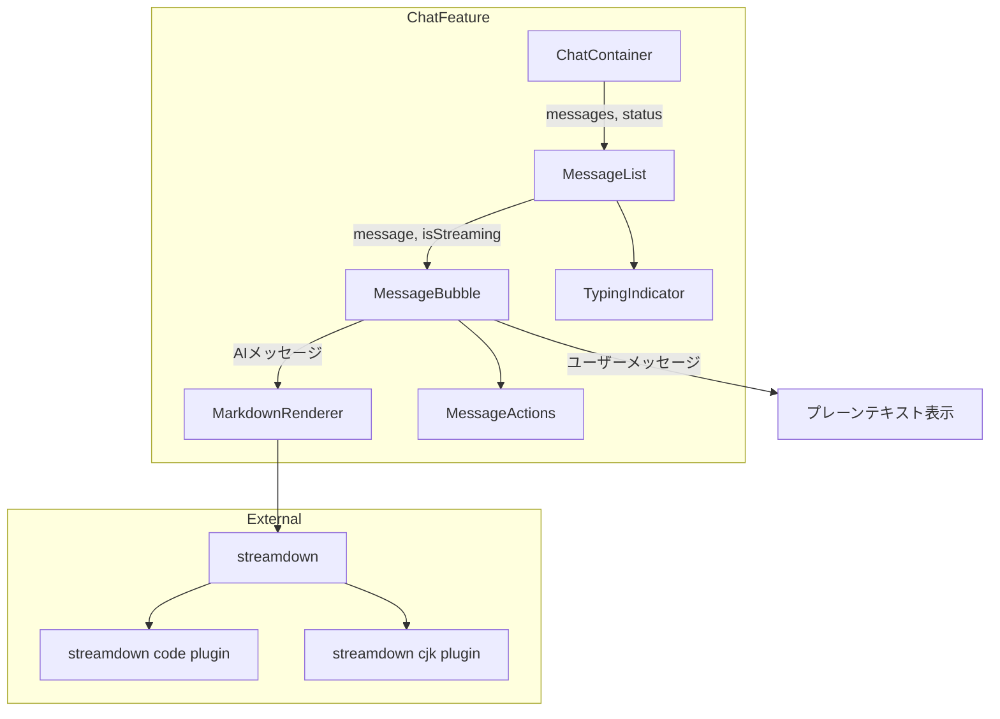
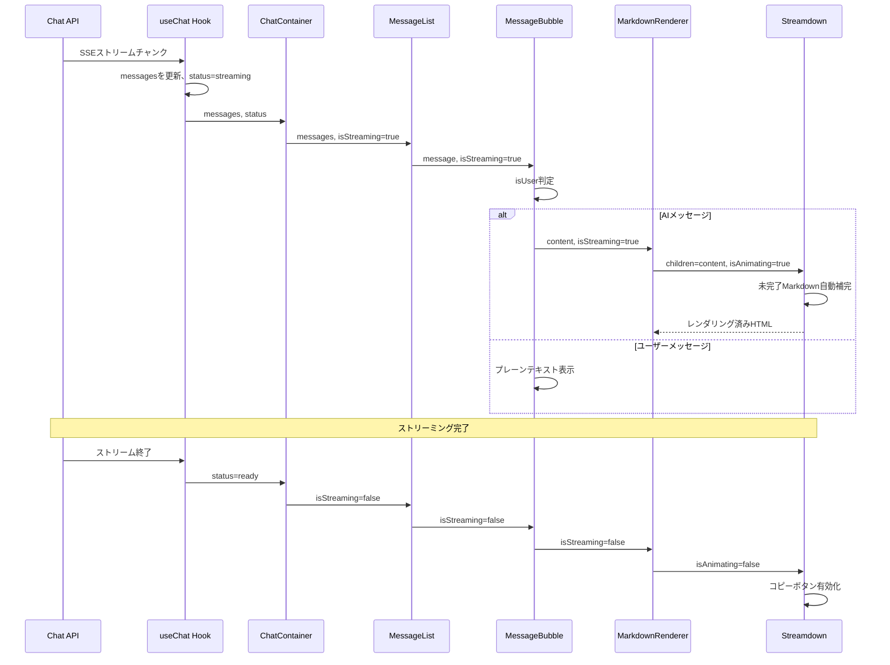

# Design Document

## Overview

**Purpose**: 本機能は、AIチャット回答内のMarkdownコンテンツ（コードブロック、見出し、リスト等）をシンタックスハイライト付きで適切にレンダリングし、開発者にとって見やすく操作しやすいコード表示体験を提供する。

**Users**: help-naviを利用する開発者が、AIエージェントからのコード例や技術的な回答をチャットUI上で構造化された形式で閲覧・コピーするワークフローで活用する。

**Impact**: 現在のプレーンテキスト表示（`<p className="whitespace-pre-wrap">`）をAIメッセージに限りStreamdownベースのMarkdownレンダリングに置き換える。ユーザーメッセージの表示は変更しない。

### Goals
- AIメッセージのMarkdownコンテンツを構造化されたHTMLとしてレンダリングする
- コードブロックにShikiベースのシンタックスハイライトを適用する（200以上の言語対応）
- コードブロックにコピーボタンと言語ラベルを提供する
- ストリーミング中の部分的Markdownを安定してレンダリングする
- ダークモード・ライトモードの両方で一貫したスタイルを維持する

### Non-Goals
- ユーザーメッセージへのMarkdownレンダリング適用
- LaTeX数式レンダリング（`@streamdown/math`は本スコープ外）
- Mermaidダイアグラムのリアルタイムレンダリング
- カスタムコードブロックUIの自作（Streamdown組み込み機能を利用）
- メッセージの永続化形式の変更（既存のプレーンテキスト保存を維持）

## Architecture

### Existing Architecture Analysis

現在のチャットUIはcontainer/presentationalパターンで構築されている。

- **ChatContainer**（container）: `useChat`フックからの`status`を`isStreaming`に変換し、`MessageList`に伝播
- **MessageList**（presentational）: メッセージ配列をイテレートし`MessageBubble`を描画。`isStreaming`は`TypingIndicator`の表示制御にのみ使用
- **MessageBubble**（presentational）: `message.role`で表示を分岐。AIメッセージは`extractTextContent`でテキスト抽出後、`<p className="whitespace-pre-wrap">`で表示
- **MessageActions**: メッセージ全体のコピー・再生成ボタンを提供

本設計では、MessageBubble内のAIメッセージ表示部分のみを新規MarkdownRendererコンポーネントに置き換える。既存のMessageActions（メッセージ全体コピー）は維持し、Streamdown組み込みのコードブロック単位コピーボタンと共存させる。

### Architecture Pattern & Boundary Map



**Architecture Integration**:
- Selected pattern: 既存のcontainer/presentationalパターンを拡張。新規MarkdownRendererをpresentationalコンポーネントとして追加
- Domain/feature boundaries: MarkdownRendererはchat feature内に配置（`src/features/chat/components/`）。Streamdownの設定を一元管理する
- Existing patterns preserved: container/presentationalパターン、props伝播、ダークモード対応
- New components rationale: MarkdownRendererはStreamdownの設定集約と関心の分離のために必要
- Steering compliance: featuresディレクトリ内のコンポーネント配置規約、kebab-caseファイル名、JSDoc日本語コメント規約を遵守

### Technology Stack

| Layer | Choice / Version | Role in Feature | Notes |
|-------|------------------|-----------------|-------|
| Frontend | `streamdown` v2.3.0 | Markdownレンダリングエンジン | Vercel製、ストリーミング最適化 |
| Frontend | `@streamdown/code` | Shikiベースシンタックスハイライト | 200+言語、遅延読み込み |
| Frontend | `@streamdown/cjk` | 日本語テキストサポート | CJK文字の適切な表示 |
| Frontend | React 19.x | UIコンポーネント基盤 | 既存 |
| Styling | Tailwind CSS v4 | スタイリング | `@source`ディレクティブ追加が必要 |

## System Flows

### ストリーミング中のMarkdownレンダリングフロー



## Requirements Traceability

| Requirement | Summary | Components | Interfaces | Flows |
|-------------|---------|------------|------------|-------|
| 1.1 | MarkdownをHTML要素としてレンダリング | MarkdownRenderer, MessageBubble | MarkdownRendererProps | ストリーミングフロー |
| 1.2 | フェンスドコードブロックのレンダリング | MarkdownRenderer | StreamdownProps | - |
| 1.3 | インラインコードの視覚的区別表示 | MarkdownRenderer | StreamdownProps | - |
| 1.4 | 見出し・リスト等の基本Markdown要素 | MarkdownRenderer | StreamdownProps | - |
| 1.5 | ユーザーメッセージはプレーンテキスト維持 | MessageBubble | MessageBubbleProps | - |
| 2.1 | 言語指定ありコードのシンタックスハイライト | MarkdownRenderer | CodePluginConfig | - |
| 2.2 | 言語指定なしコードのハイライトなし表示 | MarkdownRenderer | CodePluginConfig | - |
| 2.3 | 主要プログラミング言語のハイライト対応 | MarkdownRenderer | CodePluginConfig | - |
| 2.4 | ダーク/ライト両対応ハイライトテーマ | MarkdownRenderer | CodePluginConfig | - |
| 3.1 | コードブロックヘッダーに言語ラベル表示 | MarkdownRenderer | Streamdown built-in | - |
| 3.2 | 言語指定なし時のラベル非表示/汎用ラベル | MarkdownRenderer | Streamdown built-in | - |
| 3.3 | コピーボタンの表示 | MarkdownRenderer | Streamdown built-in | - |
| 3.4 | コピーボタンでクリップボードコピー | MarkdownRenderer | Streamdown built-in | - |
| 3.5 | コピー完了の視覚的フィードバック | MarkdownRenderer | Streamdown built-in | - |
| 4.1 | ストリーミング中のMarkdown逐次レンダリング | MarkdownRenderer, MessageBubble, MessageList | MarkdownRendererProps | ストリーミングフロー |
| 4.2 | 未完了コードブロックの部分表示 | MarkdownRenderer | Streamdown parseIncompleteMarkdown | ストリーミングフロー |
| 4.3 | ストリーミング完了後の最終表示確定 | MarkdownRenderer | MarkdownRendererProps | ストリーミングフロー |
| 5.1 | メッセージバブルデザインとの一貫性 | MarkdownRenderer, MessageBubble | className | - |
| 5.2 | ダーク/ライトモード対応 | MarkdownRenderer | shikiTheme | - |
| 5.3 | 長いコード行の水平スクロール | MarkdownRenderer | CSS overflow-x | - |
| 5.4 | モバイルビューポート対応 | MarkdownRenderer | CSS responsive | - |

## Components and Interfaces

| Component | Domain/Layer | Intent | Req Coverage | Key Dependencies | Contracts |
|-----------|--------------|--------|--------------|-----------------|-----------|
| MarkdownRenderer | Chat UI | StreamdownによるMarkdownレンダリングの設定集約 | 1.1-1.4, 2.1-2.4, 3.1-3.5, 4.1-4.3, 5.1-5.4 | streamdown (P0), @streamdown/code (P0), @streamdown/cjk (P1) | State |
| MessageBubble | Chat UI | ユーザー/AI判定によるレンダリング分岐 | 1.5, 4.1 | MarkdownRenderer (P0) | State |
| MessageList | Chat UI | isStreamingのMessageBubbleへの伝播 | 4.1 | MessageBubble (P0) | State |
| globals.css | Styling | Streamdown用Tailwind `@source`ディレクティブ追加 | 5.1-5.4 | tailwindcss (P0) | - |

### Chat UI Layer

#### MarkdownRenderer

| Field | Detail |
|-------|--------|
| Intent | Streamdownコンポーネントの設定を集約し、Markdownコンテンツをレンダリングする |
| Requirements | 1.1, 1.2, 1.3, 1.4, 2.1, 2.2, 2.3, 2.4, 3.1, 3.2, 3.3, 3.4, 3.5, 4.1, 4.2, 4.3, 5.1, 5.2, 5.3, 5.4 |

**Responsibilities & Constraints**
- Streamdownコンポーネントのプラグイン設定（code, cjk）を一元管理する
- `isStreaming`プロパティをStreamdownの`isAnimating`プロパティにマッピングする
- シンタックスハイライトテーマのデュアルテーマ設定を管理する
- コードブロックのコピーボタン・言語ラベルはStreamdown組み込み機能に委任する

**Dependencies**
- Inbound: MessageBubble -- Markdownコンテンツとストリーミング状態を受け取る (P0)
- External: `streamdown` -- Markdownレンダリングエンジン (P0)
- External: `@streamdown/code` -- Shikiベースシンタックスハイライト (P0)
- External: `@streamdown/cjk` -- CJK文字サポート (P1)

**Contracts**: State [x]

##### State Management

```typescript
/** MarkdownRenderer のプロパティ */
interface MarkdownRendererProps {
  /** レンダリング対象のMarkdownテキスト */
  content: string;
  /** ストリーミング中かどうか */
  isStreaming: boolean;
}
```

- State model: propsのみで状態を管理。内部状態は持たない
- Persistence & consistency: 表示のみのコンポーネント、永続化不要

**Implementation Notes**
- Integration: `streamdown/styles.css`のインポートが必要（animated prop使用のため）。`createCodePlugin`で`@streamdown/code`のテーマを設定する。プラグインインスタンスはモジュールスコープで生成してレンダリング毎の再生成を防止する
- Validation: `content`が空文字列の場合は空のレンダリング結果を返す
- Risks: Streamdownのバージョンアップ時にAPI変更の影響を受ける可能性があるが、ラッパーコンポーネントにより影響範囲を限定

#### MessageBubble（既存コンポーネント変更）

| Field | Detail |
|-------|--------|
| Intent | ユーザー/AI判定に基づきプレーンテキストまたはMarkdownレンダリングを切り替える |
| Requirements | 1.5, 4.1 |

**Responsibilities & Constraints**
- `message.role === "user"`の場合は既存のプレーンテキスト表示を維持する
- `message.role === "assistant"`の場合はMarkdownRendererにコンテンツを委任する
- `isStreaming`プロパティを受け取り、最後のAIメッセージかどうかの判定と合わせてMarkdownRendererに伝播する

**Dependencies**
- Inbound: MessageList -- メッセージデータとストリーミング状態を受け取る (P0)
- Outbound: MarkdownRenderer -- AIメッセージのレンダリングを委任する (P0)
- Outbound: MessageActions -- メッセージ全体のコピー・再生成を委任する (P0)

**Contracts**: State [x]

##### State Management

```typescript
/** MessageBubble のプロパティ（変更後） */
interface MessageBubbleProps {
  /** メッセージデータ */
  message: UIMessage;
  /** ストリーミング中かどうか */
  isStreaming: boolean;
  /** コピーコールバック */
  onCopy: (content: string) => void;
  /** リトライコールバック */
  onRegenerate: () => void;
}
```

- State model: propsベース、新たに`isStreaming`プロパティを追加
- 分岐ロジック: `isUser`判定で表示コンポーネントを切り替え。`isStreaming`はAIメッセージの場合のみMarkdownRendererに伝播

**Implementation Notes**
- Integration: `isStreaming`プロパティはMessageListの最後のAIメッセージのみがtrueとなるよう、MessageList側で制御する。具体的には、最後のメッセージかつ`isStreaming`がtrueの場合にのみ`isStreaming=true`をMessageBubbleに渡す
- Validation: `extractTextContent`関数は既存のまま維持。MarkdownRendererにもプレーンテキスト化前の結合済みテキストを渡す

#### MessageList（既存コンポーネント変更）

| Field | Detail |
|-------|--------|
| Intent | isStreamingプロパティをMessageBubbleに伝播する |
| Requirements | 4.1 |

**Responsibilities & Constraints**
- 最後のメッセージかつストリーミング中の場合のみ`isStreaming=true`をMessageBubbleに渡す

**Contracts**: State [x]

##### State Management

```typescript
/** MessageList のプロパティ（変更なし） */
interface MessageListProps {
  /** メッセージ一覧 */
  messages: UIMessage[];
  /** ストリーミング中かどうか */
  isStreaming: boolean;
  /** コピーコールバック */
  onCopy: (content: string) => void;
  /** リトライコールバック */
  onRegenerate: () => void;
}
```

- State model: 既存のpropsインターフェースに変更なし。MessageBubbleへの`isStreaming`伝播ロジックのみ追加
- 伝播ルール: `messages`配列の最後のメッセージのインデックスと`isStreaming`フラグを組み合わせて、各MessageBubbleの`isStreaming`プロパティを決定する

**Implementation Notes**
- Integration: `messages.map`内で最後のメッセージかどうかを判定し、`isStreaming && index === messages.length - 1`をMessageBubbleに渡す

### Styling Layer

#### globals.css（既存ファイル変更）

| Field | Detail |
|-------|--------|
| Intent | Streamdownのユーティリティクラスをtailwindcssに認識させる |
| Requirements | 5.1, 5.2, 5.3, 5.4 |

**Implementation Notes**
- Integration: 以下の`@source`ディレクティブを追加する
  - `@source "../node_modules/streamdown/dist/*.js";`
  - `@source "../node_modules/@streamdown/code/dist/*.js";`
- Risks: monorepo構成の場合はパスの調整が必要だが、本プロジェクトは単一パッケージ構成のため標準パスで動作する

## Error Handling

### Error Strategy

本機能はフロントエンド表示のみの変更であり、エラーハンドリングは最小限に留める。

### Error Categories and Responses

**User Errors**: 該当なし（ユーザー入力に依存する処理がない）

**System Errors**:
- Streamdownレンダリングエラー: Reactのエラーバウンダリによるフォールバック表示。プレーンテキスト表示にグレースフルデグレードする
- Shiki言語グラマーの遅延読み込み失敗: Streamdownが内部的にフォールバック処理を行うため、ハイライトなしのコードブロックとして表示される
- クリップボードAPIエラー: Streamdownの組み込みコピーボタンが内部的に処理する

## Testing Strategy

### Unit Tests
- **MarkdownRenderer**: Streamdownコンポーネントが正しいpropsで描画されることを検証
- **MessageBubble（AIメッセージ）**: `role === "assistant"`時にMarkdownRendererが使用されることを検証
- **MessageBubble（ユーザーメッセージ）**: `role === "user"`時にプレーンテキスト表示が維持されることを検証
- **MessageList isStreaming伝播**: 最後のメッセージのみに`isStreaming=true`が渡されることを検証

### Integration Tests
- **ストリーミング表示フロー**: useChatのstatus変化に応じてisAnimatingが正しく切り替わることを検証
- **ダークモード切り替え**: ライト/ダークモードでコードブロックテーマが適切に切り替わることを検証
- **Markdownレンダリング統合**: コードブロック、見出し、リスト等の各Markdown要素が正しくレンダリングされることを検証

### E2E/UI Tests
- **コードブロックコピー**: コピーボタンクリック後にクリップボードにコードが格納されることを検証
- **ストリーミング中の表示安定性**: 未完了Markdownがレイアウト崩れなく表示されることを検証
- **モバイル表示**: コードブロックの水平スクロールとコピーボタン常時表示を検証
