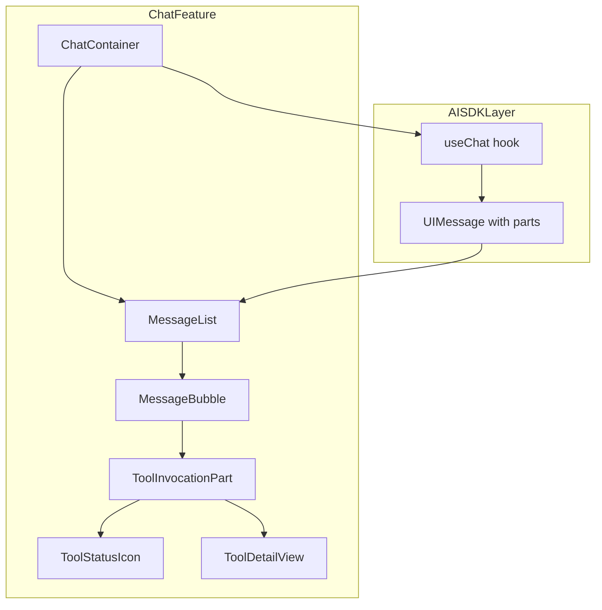
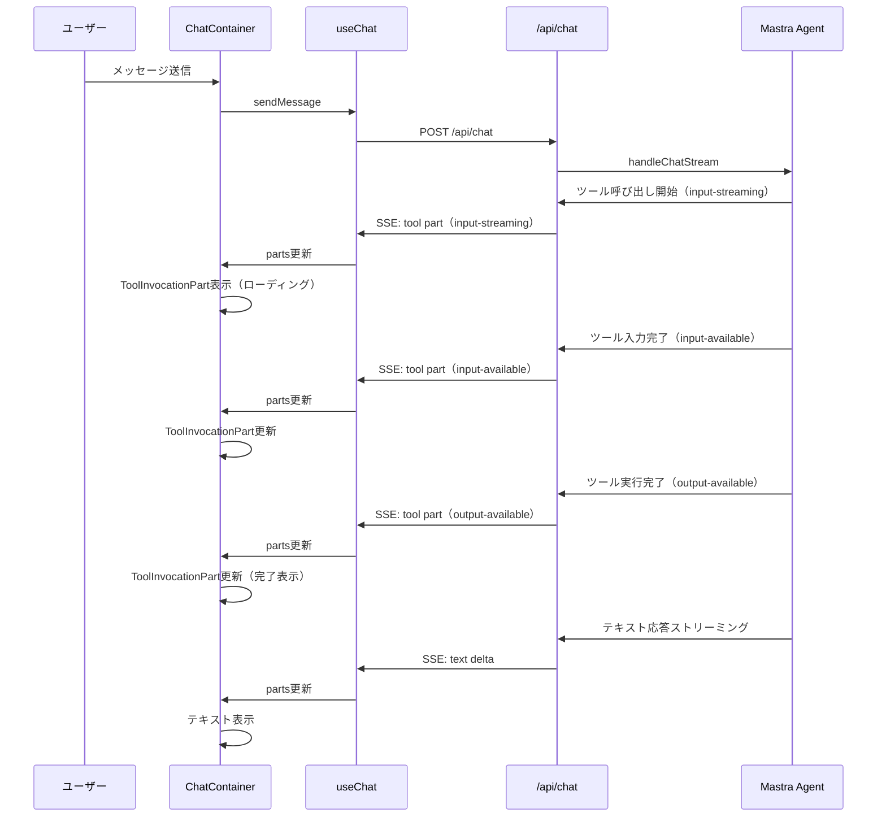
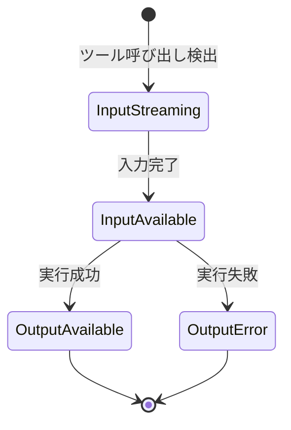

# Technical Design: AI Response Stream UI

## Overview

**Purpose**: 本機能は、AIエージェントがツール（Web検索、S3ファイル操作など）を実行している際の中間プロセスを、チャットUI上にリアルタイムで視覚的にフィードバックする。ツール呼び出しの状況（ツール名、実行状態、入出力詳細）をストリーミング表示することで、AIの思考・行動プロセスを透明化し、ユーザーの待機体験を改善する。

**Users**: チャットインターフェースを利用する全ユーザーが、AIのツール実行状況を確認しながら応答を待機できるようになる。

**Impact**: 既存の `MessageBubble` コンポーネントを拡張し、AI SDK の `UIMessage.parts` に含まれるツール呼び出しパーツを検出・表示する。バックエンドの変更は不要。

### Goals
- ツール呼び出しの実行状態（実行中/完了/エラー）をリアルタイムに表示する
- ツール呼び出しの詳細（入力パラメータ、実行結果）を展開/折りたたみで確認可能にする
- 複数ツールの順次呼び出しを時系列で表示する
- ストリーミング中のUI更新を安定的に行い、ちらつきやレイアウトジャンプを抑制する

### Non-Goals
- ツール呼び出しのリトライ機能（ユーザーによる再実行）
- ツール呼び出し履歴のDB永続化
- サーバーサイド（API ルート / Mastra エージェント）の変更
- ツール呼び出しの承認フロー（`approval-requested` 状態の対応）

## Architecture

### Existing Architecture Analysis

現在のチャットUIは以下の構成で動作している:
- `ChatContainer`（container） → `MessageList`（presentational） → `MessageBubble`（presentational）
- `MessageBubble` は `UIMessage.parts` から `text` タイプのパーツのみを抽出し、ツールパーツは無視
- AI SDK v6 の `useChat` フックは、Mastra エージェントのツール呼び出しを `tool-${toolName}` 型のパーツとしてストリーム経由で自動的に `UIMessage.parts` に含める
- サーバーサイドの `handleChatStream` + `createUIMessageStreamResponse` はツール呼び出し情報を既にストリームに含んでおり、バックエンドの変更は不要

### Architecture Pattern & Boundary Map



**Architecture Integration**:
- 選択パターン: 既存の container/presentational パターンを踏襲した拡張
- `MessageBubble` 内で `parts` 配列をイテレートし、`text` パーツと `tool-*` パーツを分岐レンダリング
- 新規コンポーネント `ToolInvocationPart` はツール表示の責務を分離
- Steering 準拠: `src/features/chat/components/` 配下に配置、依存方向は上位→下位のみ

### Technology Stack

| Layer | Choice / Version | Role in Feature | Notes |
|-------|------------------|-----------------|-------|
| Frontend | React 19.x + `@ai-sdk/react` v3 | ツールパーツのレンダリング、状態表示 | `UIMessage.parts` のツールパーツ型を利用 |
| AI SDK | `ai` v6 | ストリーミング、UIMessage型定義 | ツールパーツの状態管理は SDK が自動で実施 |
| CSS | Tailwind CSS v4 | スタイリング、アニメーション | 既存のデザインシステムを踏襲 |

## System Flows

### ツール呼び出しストリーミングフロー



### ツール表示の状態遷移



## Requirements Traceability

| Requirement | Summary | Components | Interfaces | Flows |
|-------------|---------|------------|------------|-------|
| 1.1 | ツール実行中インジケーター表示 | ToolInvocationPart, ToolStatusIcon | ToolInvocationPartProps | ストリーミングフロー |
| 1.2 | 実行完了時のインジケーター更新 | ToolInvocationPart, ToolStatusIcon | ToolInvocationPartProps | 状態遷移フロー |
| 1.3 | ツール名の表示 | ToolInvocationPart, toolDisplayNames | ToolInvocationPartProps | - |
| 1.4 | 実行中ローディングアニメーション | ToolStatusIcon | ToolStatusIconProps | - |
| 2.1 | デフォルト折りたたみ表示 | ToolInvocationPart | ToolInvocationPartProps | - |
| 2.2 | クリックで詳細展開 | ToolInvocationPart, ToolDetailView | ToolDetailViewProps | - |
| 2.3 | クリックで詳細折りたたみ | ToolInvocationPart | ToolInvocationPartProps | - |
| 2.4 | 実行中は自動展開 | ToolInvocationPart | ToolInvocationPartProps | 状態遷移フロー |
| 3.1 | 複数ツールの順序表示 | MessageBubble | - | ストリーミングフロー |
| 3.2 | 各ツールのステータス表示 | ToolStatusIcon | ToolStatusIconProps | - |
| 3.3 | 全ツール完了後にテキスト表示 | MessageBubble | - | ストリーミングフロー |
| 4.1 | リアルタイムUI反映 | MessageBubble, ToolInvocationPart | - | ストリーミングフロー |
| 4.2 | ちらつき・ジャンプ抑制 | ToolInvocationPart | - | - |
| 4.3 | 自動スクロール | MessageList | - | - |
| 5.1 | エラー状態の視覚的インジケーター | ToolStatusIcon | ToolStatusIconProps | 状態遷移フロー |
| 5.2 | エラー概要の展開時表示 | ToolDetailView | ToolDetailViewProps | - |
| 5.3 | エラー詳細の確認 | ToolDetailView | ToolDetailViewProps | - |

## Components and Interfaces

| Component | Domain/Layer | Intent | Req Coverage | Key Dependencies | Contracts |
|-----------|--------------|--------|--------------|------------------|-----------|
| MessageBubble（拡張） | UI / Presentational | partsイテレーションを拡張しツールパーツを検出・委譲 | 3.1, 3.3, 4.1 | ToolInvocationPart (P0) | - |
| ToolInvocationPart | UI / Presentational | 個別ツール呼び出しの状態表示と展開/折りたたみ管理 | 1.1, 1.2, 1.3, 2.1, 2.2, 2.3, 2.4, 4.2 | ToolStatusIcon (P1), ToolDetailView (P1) | State |
| ToolStatusIcon | UI / Presentational | ツール状態に応じたアイコン・アニメーション表示 | 1.4, 3.2, 5.1 | - | - |
| ToolDetailView | UI / Presentational | ツール入出力の詳細表示 | 2.2, 5.2, 5.3 | - | - |
| toolDisplayNames | Lib / Utility | ツール名のローカライズマッピング | 1.3 | - | - |
| MessageList（拡張） | UI / Presentational | 自動スクロールのツールパーツ対応 | 4.3 | - | - |

### UI Layer

#### MessageBubble（拡張）

| Field | Detail |
|-------|--------|
| Intent | `UIMessage.parts` のイテレーションを拡張し、`text` パーツに加えてツール呼び出しパーツを検出・レンダリングする |
| Requirements | 3.1, 3.3, 4.1 |

**Responsibilities & Constraints**
- `message.parts` 配列を順序通りにイテレートし、パーツタイプに応じたコンポーネントを描画
- `text` パーツは既存の `MarkdownRenderer` に委譲
- ツールパーツ（`tool-*` 型、または `toolName` プロパティを持つパーツ）は `ToolInvocationPart` に委譲
- パーツの出現順序を維持し、ツール呼び出しとテキストが交互に表示される場合も正しく描画

**Dependencies**
- Inbound: MessageList — メッセージデータの提供 (P0)
- Outbound: ToolInvocationPart — ツールパーツの描画委譲 (P0)
- Outbound: MarkdownRenderer — テキストパーツの描画委譲 (P0)

**Contracts**: State [ ]

**Implementation Notes**
- 現在の `extractTextContent` 関数を廃止し、`parts` 配列の直接イテレーションに変更
- ユーザーメッセージ（`role === "user"`）はツールパーツを持たないため、既存のテキスト表示を維持

#### ToolInvocationPart

| Field | Detail |
|-------|--------|
| Intent | 個別のツール呼び出しを表示し、状態に応じたインジケーター・展開/折りたたみ機能を提供する |
| Requirements | 1.1, 1.2, 1.3, 2.1, 2.2, 2.3, 2.4, 4.2 |

**Responsibilities & Constraints**
- ツール呼び出しパーツの状態（`input-streaming`, `input-available`, `output-available`, `output-error`）に応じた表示切り替え
- 展開/折りたたみのローカル状態管理
- 実行中（`input-streaming`, `input-available`）はデフォルト展開、完了・エラーはデフォルト折りたたみ
- CSS `transition` と `min-height` でレイアウト安定性を確保

**Dependencies**
- Inbound: MessageBubble — ツールパーツデータの提供 (P0)
- Outbound: ToolStatusIcon — 状態アイコンの描画 (P1)
- Outbound: ToolDetailView — 詳細情報の描画 (P1)
- External: toolDisplayNames — ツール名のローカライズ (P2)

**Contracts**: State [x]

##### State Management

```typescript
/** ツール呼び出しの状態型 */
type ToolInvocationState =
  | "input-streaming"
  | "input-available"
  | "output-available"
  | "output-error";

/** ToolInvocationPart のProps */
interface ToolInvocationPartProps {
  /** ツール呼び出しID */
  toolCallId: string;
  /** ツール名（API名） */
  toolName: string;
  /** 現在の状態 */
  state: ToolInvocationState;
  /** ツール入力パラメータ */
  input: Record<string, unknown>;
  /** ツール出力結果（output-available時のみ） */
  output?: unknown;
  /** エラーテキスト（output-error時のみ） */
  errorText?: string;
}
```

- State model: `isExpanded: boolean`（ローカル `useState`）
- 初期値: `state` が `input-streaming` または `input-available` の場合は `true`、それ以外は `false`
- `state` が実行中から完了/エラーに遷移した際、`isExpanded` を `false` に自動更新（`useEffect`）

**Implementation Notes**
- ツール表示のルートは `<details>` / `<summary>` 要素ではなく、カスタムの展開/折りたたみ実装（アニメーション制御のため）
- `min-height: 40px` で折りたたみ時の最小サイズを確保し、パーツ追加時のレイアウトジャンプを抑制
- `transition: all 200ms ease-in-out` で展開/折りたたみアニメーションを実現

#### ToolStatusIcon

| Field | Detail |
|-------|--------|
| Intent | ツール状態に応じたアイコンとローディングアニメーションを提供する |
| Requirements | 1.4, 3.2, 5.1 |

**Responsibilities & Constraints**
- `input-streaming` / `input-available`: 回転するスピナーアイコン（`animate-spin`）
- `output-available`: チェックマークアイコン（緑色）
- `output-error`: エラーアイコン（赤色）

**Implementation Notes**
- アイコンはSVGインラインで実装（外部アイコンライブラリの依存を避ける）
- Tailwind CSSの `animate-spin` でローディングアニメーションを実現

#### ToolDetailView

| Field | Detail |
|-------|--------|
| Intent | ツール入力パラメータと実行結果の詳細を構造化して表示する |
| Requirements | 2.2, 5.2, 5.3 |

**Responsibilities & Constraints**
- 入力パラメータを key-value 形式で表示
- 実行結果を JSON フォーマットで表示（`output-available` 状態時）
- エラー情報を赤色背景で表示（`output-error` 状態時）
- 長大な出力は最大500文字で切り詰め、省略記号を表示

```typescript
/** ToolDetailView のProps */
interface ToolDetailViewProps {
  /** ツール入力パラメータ */
  input: Record<string, unknown>;
  /** ツールの状態 */
  state: ToolInvocationState;
  /** ツール出力結果（output-available時のみ） */
  output?: unknown;
  /** エラーテキスト（output-error時のみ） */
  errorText?: string;
}
```

**Implementation Notes**
- 入力/出力の表示には `JSON.stringify(value, null, 2)` を使用し、`<pre>` タグで整形表示
- 出力が500文字を超える場合は切り詰めて `"... (省略)"` を付加

### Lib Layer

#### toolDisplayNames

| Field | Detail |
|-------|--------|
| Intent | ツールのAPI名を日本語の表示名にマッピングする |
| Requirements | 1.3 |

**Responsibilities & Constraints**
- 既知のツール名に対するローカライズマッピングを提供
- 未登録のツール名はそのまま返却

```typescript
/** ツール表示名マッピング */
const TOOL_DISPLAY_NAMES: Record<string, string> = {
  webSearch: "Web検索",
  s3ListObjects: "ファイル一覧取得",
  s3GetObject: "ファイル読み取り",
  s3PutObject: "ファイルアップロード",
};

/** ツール名を表示名に変換する */
function getToolDisplayName(toolName: string): string;
```

**Implementation Notes**
- `src/lib/tool-display-names.ts` に配置し、`src/features/chat/components/` から参照
- 新しいツールが追加された場合、このマッピングに追記する運用

### MessageList（拡張）

| Field | Detail |
|-------|--------|
| Intent | ツールパーツ追加時の自動スクロール対応を強化する |
| Requirements | 4.3 |

**Implementation Notes**
- 既存の自動スクロールは `messages` 配列の変更を監視しているが、ツールパーツの状態更新でも自動スクロールを発動させる
- `useEffect` の依存配列に `messages` の最後のメッセージの `parts.length` を含め、パーツ追加時にもスクロールを発火

## Error Handling

### Error Strategy

ツール呼び出しのエラーは AI SDK がパーツの状態として管理する。フロントエンドはエラー状態の表示に専念し、リカバリは行わない。

### Error Categories and Responses

**ツール実行エラー**（`output-error` 状態）:
- `ToolStatusIcon` に赤色エラーアイコンを表示
- `ToolDetailView` にエラーテキスト（`errorText`）を赤色背景で表示
- 折りたたみ時もエラーアイコンで状態を明示

**パーツデータ不正**:
- `toolName` や `state` が undefined の場合、パーツをスキップしてレンダリングしない
- コンソールに警告ログを出力

## Testing Strategy

### Unit Tests
- `ToolInvocationPart`: 各状態（`input-streaming`, `input-available`, `output-available`, `output-error`）での正しい描画
- `ToolInvocationPart`: 展開/折りたたみの動作（クリックイベント、初期状態）
- `ToolStatusIcon`: 各状態でのアイコン・アニメーション描画
- `ToolDetailView`: 入力/出力/エラーの正しい表示、長大データの切り詰め
- `getToolDisplayName`: 既知・未知のツール名のマッピング

### Integration Tests
- `MessageBubble`: ツールパーツとテキストパーツが混在するメッセージの正しいレンダリング順序
- `MessageBubble`: 複数ツール呼び出しを含むメッセージのリスト表示
- `MessageList`: ツールパーツ追加時の自動スクロール動作

### E2E/UI Tests
- ツール使用を伴うメッセージ送信時に、ツールインジケーターが表示されること
- ツール呼び出し表示の展開/折りたたみが正常動作すること
- エラー状態のツール呼び出しが赤色インジケーターで表示されること
