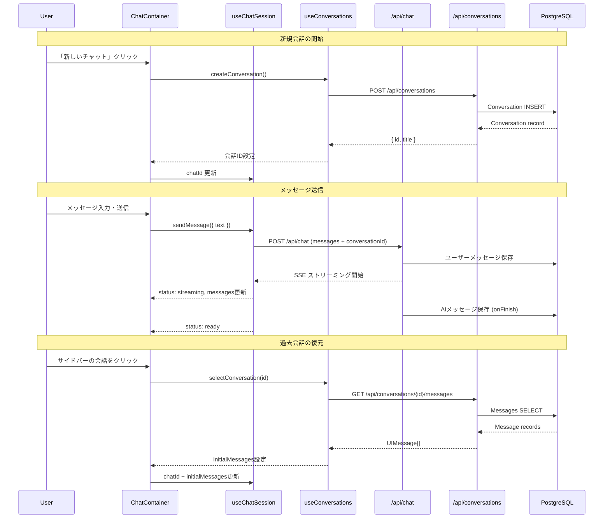
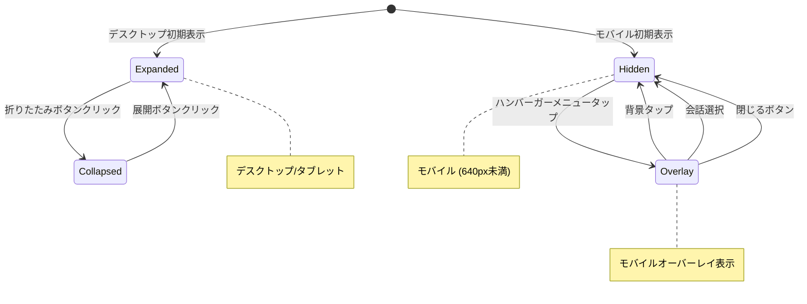
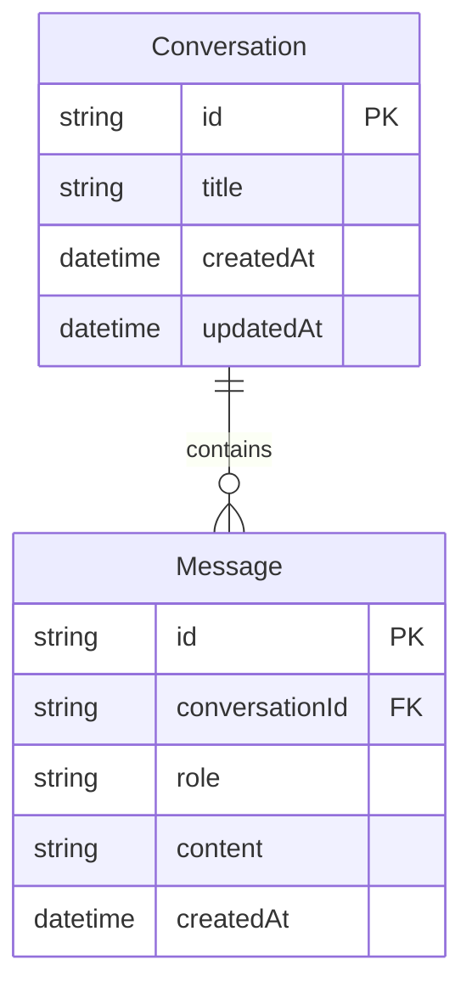

# Design Document: チャット画面リデザイン

## Overview

本機能は、help-naviプロジェクトのチャット画面をGitHub Copilotのチャット画面をリファレンスとした2カラムレイアウトにリデザインし、会話履歴のデータ永続化とコンポーネント構成のリファクタリングを実現する。

**Purpose**: 現在の単一コンポーネント（`src/components/chat.tsx`）で構成された最小限のチャットUIを、左サイドバー（会話履歴管理）とメインチャットエリアの2カラムレイアウトに再構成し、モダンなチャットアプリケーションとしての操作性・視認性を大幅に向上させる。

**Users**: help-naviのエンドユーザーがAIエージェントとの対話で利用する。開発者は保守性の高いコンポーネント構成の恩恵を受ける。

**Impact**: 既存の `src/components/chat.tsx` を `src/features/chat/` 配下のContainer/Presentationalパターンに移行する。既存のチャットAPI（`/api/chat`）は維持しつつ、会話CRUD用APIルートを新規追加する。Prismaスキーマに `Conversation` / `Message` モデルを追加する。

### Goals
- 2カラムレイアウト（左サイドバー + メインチャットエリア）でモダンなチャットUIを提供する
- 会話履歴のPostgreSQL永続化により、ブラウザを閉じても対話内容を保持する
- Container/Presentationalパターンによるコンポーネント分離で保守性・拡張性を向上させる
- レスポンシブ対応（モバイル/タブレット/デスクトップ）を実現する
- Markdownレンダリング、コピー、リトライ等のアクション機能を提供する

### Non-Goals
- ダークモード対応（既存のCSS変数ベースのダークモードは維持するが、新たなテーマシステムの構築は行わない）
- アクセシビリティ対応（WCAG準拠等の包括的なアクセシビリティ改善は行わない）
- ユーザー認証・認可（マルチユーザー対応は行わない。単一ユーザーとして全会話を管理する）
- リアルタイム同期（WebSocket等によるマルチデバイス間同期は行わない）

## Architecture

### Existing Architecture Analysis

現在のアーキテクチャは以下の構成である。

- `src/components/chat.tsx`: 単一のクライアントコンポーネントに全チャットロジック（useChat呼び出し、状態管理、UI表示）が集約されている
- `src/app/api/chat/route.ts`: MastraエージェントへのストリーミングチャットAPIエンドポイント
- `src/app/page.tsx`: サーバーコンポーネントとして `Chat` コンポーネントを呼び出し
- Prismaスキーマはセットアップ済みだがモデル定義なし（datasource + generator のみ）

**既存パターンの保持事項**:
- `useChat` + `DefaultChatTransport` によるストリーミングチャットの基本構成
- Mastraエージェントとの統合パターン（`handleChatStream`）
- PrismaClientのシングルトンパターン（`src/infrastructure/prisma-client.ts`）
- page.tsx はサーバーコンポーネントとして維持

### Architecture Pattern & Boundary Map

```mermaid
graph TB
    subgraph App Layer
        Page[page.tsx - Server Component]
    end

    subgraph Feature Layer - chat
        Container[ChatContainer]
        subgraph Hooks
            UseConversations[useConversations]
            UseChatSession[useChatSession]
            UseSidebar[useSidebar]
        end
        subgraph Presentational
            Layout[ChatLayout]
            Sidebar[ChatSidebar]
            Header[ChatHeader]
            MessageList[MessageList]
            MessageBubble[MessageBubble]
            MessageActions[MessageActions]
            InputArea[ChatInputArea]
            WelcomeScreen[WelcomeScreen]
            TypingIndicator[TypingIndicator]
        end
    end

    subgraph API Layer
        ChatAPI[POST /api/chat]
        ConvAPI[/api/conversations]
    end

    subgraph Data Layer
        Prisma[PrismaClient]
        DB[(PostgreSQL)]
    end

    subgraph External
        Mastra[Mastra Agent]
    end

    Page --> Container
    Container --> UseConversations
    Container --> UseChatSession
    Container --> UseSidebar
    Container --> Layout
    Layout --> Sidebar
    Layout --> Header
    Layout --> MessageList
    Layout --> InputArea
    MessageList --> MessageBubble
    MessageList --> WelcomeScreen
    MessageList --> TypingIndicator
    MessageBubble --> MessageActions
    UseChatSession --> ChatAPI
    UseConversations --> ConvAPI
    ChatAPI --> Mastra
    ChatAPI --> Prisma
    ConvAPI --> Prisma
    Prisma --> DB
```

**Architecture Integration**:
- **Selected pattern**: Container/Presentational + Custom Hooks（steering の `structure.md` 準拠）
- **Domain boundaries**: チャット機能は `src/features/chat/` に完全に閉じ、他機能への依存なし
- **Existing patterns preserved**: useChat + DefaultChatTransport、Mastra handleChatStream、PrismaClient シングルトン
- **New components rationale**: レイアウト分離（サイドバー/ヘッダー/メッセージ/入力）により単一責任を実現
- **Steering compliance**: 一方向依存、Container/Presentational分離、features配下管理

### Technology Stack

| Layer | Choice / Version | Role in Feature | Notes |
|-------|------------------|-----------------|-------|
| Frontend | React 19.x + Tailwind CSS 4.x | UIコンポーネント、レスポンシブレイアウト | 既存スタック |
| Frontend | streamdown | AIメッセージのストリーミングMarkdownレンダリング | 新規依存。Vercel製。ストリーミング対応、Shikiシンタックスハイライト内蔵、GFMサポート |
| Frontend | @ai-sdk/react (useChat) | ストリーミングチャットUI、状態管理 | 既存依存 |
| Backend | Next.js 16 API Routes | 会話CRUD REST API | 新規APIルート追加 |
| Data | Prisma v6.19.x + PostgreSQL | 会話・メッセージの永続化 | 既存インフラ、スキーマ追加 |

## System Flows

### 会話のライフサイクルフロー



### サイドバー状態遷移フロー



**Key Decisions**:
- サイドバー状態はデスクトップ（Expanded/Collapsed）とモバイル（Hidden/Overlay）で独立管理
- 画面幅の変化に応じてサイドバー状態を自動調整（リサイズイベント監視）
- 会話選択時にモバイルオーバーレイは自動的に閉じ、UXの摩擦を最小化

## Requirements Traceability

| Requirement | Summary | Components | Interfaces | Flows |
|-------------|---------|------------|------------|-------|
| 1.1-1.7 | 2カラムレイアウト構成 | ChatLayout, ChatSidebar, useSidebar | BaseLayoutProps | サイドバー状態遷移 |
| 2.1-2.9 | サイドバー会話一覧・管理 | ChatSidebar, useConversations | ConversationService, Conversations API | 会話ライフサイクル |
| 3.1-3.6 | サイドバー折りたたみ | ChatLayout, ChatSidebar, useSidebar | SidebarState | サイドバー状態遷移 |
| 4.1-4.6 | メインチャットヘッダー | ChatHeader, useSidebar | BaseLayoutProps | - |
| 5.1-5.6 | メッセージ表示 | MessageList, MessageBubble, WelcomeScreen | MessageDisplayProps | - |
| 6.1-6.4 | AIメッセージアクション | MessageActions | MessageActionsProps | - |
| 7.1-7.9 | メッセージ入力エリア | ChatInputArea, useChatSession | ChatInputProps | メッセージ送信 |
| 8.1-8.4 | ストリーミングフィードバック | TypingIndicator, ChatInputArea, useChatSession | StreamingState | メッセージ送信 |
| 9.1-9.7 | 会話履歴永続化 | useConversations, Conversations API, Prisma Models | ConversationService, API Contract | 会話ライフサイクル |
| 10.1-10.6 | コンポーネントリファクタリング | ChatContainer, 全Presentational, 全Hooks | - | - |

## Components and Interfaces

### コンポーネントサマリー

| Component | Domain/Layer | Intent | Req Coverage | Key Dependencies | Contracts |
|-----------|-------------|--------|--------------|------------------|-----------|
| ChatContainer | Feature/Container | チャット機能全体の状態管理とロジック集約 | 10.1-10.5 | useConversations (P0), useChatSession (P0), useSidebar (P1) | State |
| ChatLayout | Feature/Presentational | 2カラムレイアウトとレスポンシブ制御 | 1.1-1.7, 3.1-3.6 | ChatContainer (P0) | - |
| ChatSidebar | Feature/Presentational | 会話一覧表示と管理UI | 2.1-2.9, 3.1-3.6 | ChatContainer (P0) | - |
| ChatHeader | Feature/Presentational | 会話タイトルとナビゲーション表示 | 4.1-4.6 | ChatContainer (P0) | - |
| MessageList | Feature/Presentational | メッセージ一覧のスクロール表示 | 5.1-5.4 | ChatContainer (P0) | - |
| MessageBubble | Feature/Presentational | 個別メッセージのバブル表示 | 5.1-5.2, 5.6 | MessageList (P1) | - |
| MessageActions | Feature/Presentational | AIメッセージのアクションボタン | 6.1-6.4 | MessageBubble (P1) | - |
| WelcomeScreen | Feature/Presentational | 空会話時のウェルカムメッセージ | 5.5 | MessageList (P1) | - |
| ChatInputArea | Feature/Presentational | メッセージ入力・送信UI | 7.1-7.9, 8.4 | ChatContainer (P0) | - |
| TypingIndicator | Feature/Presentational | ストリーミング中のタイピングアニメーション | 8.1 | MessageList (P1) | - |
| useConversations | Feature/Hook | 会話CRUD操作と一覧管理 | 2.1-2.9, 9.1-9.7 | Conversations API (P0) | Service |
| useChatSession | Feature/Hook | useChat ラッパー、ストリーミング管理 | 7.5-7.8, 8.1-8.4 | @ai-sdk/react (P0), Chat API (P0) | Service |
| useSidebar | Feature/Hook | サイドバー開閉状態管理 | 1.5-1.7, 3.1-3.6 | - | State |
| Conversations API | API/Route | 会話CRUDエンドポイント | 9.1-9.7 | PrismaClient (P0) | API |
| Chat API (拡張) | API/Route | ストリーミングチャット + メッセージ永続化 | 9.3-9.4, 8.2-8.3 | Mastra (P0), PrismaClient (P0) | API |

### 共通インターフェース定義

```typescript
/** 会話セッションの型定義 */
interface Conversation {
  id: string;
  title: string;
  createdAt: Date;
  updatedAt: Date;
}

/** 会話一覧の項目表示用型 */
interface ConversationListItem {
  id: string;
  title: string;
  updatedAt: Date;
}

/** サイドバーの表示状態 */
type SidebarState = "expanded" | "collapsed" | "hidden" | "overlay";

/** チャットストリーミングの状態 */
type ChatStatus = "submitted" | "streaming" | "ready" | "error";
```

### Feature Layer - Hooks

#### useConversations

| Field | Detail |
|-------|--------|
| Intent | 会話一覧のCRUD操作とキャッシュ管理を担うカスタムフック |
| Requirements | 2.1-2.9, 9.1-9.7 |

**Responsibilities & Constraints**
- 会話一覧の取得（更新日時降順）、新規作成、削除、タイトル更新
- クライアント側での会話一覧キャッシュの管理
- 選択中の会話IDの管理と切替
- 会話選択時のメッセージ取得

**Dependencies**
- Outbound: Conversations API -- 会話CRUD操作 (P0)

**Contracts**: Service [x] / API [ ] / Event [ ] / Batch [ ] / State [x]

##### Service Interface
```typescript
interface UseConversationsReturn {
  /** 会話一覧（更新日時降順） */
  conversations: ConversationListItem[];
  /** 現在選択中の会話ID（null = 未選択） */
  activeConversationId: string | null;
  /** ローディング状態 */
  isLoading: boolean;
  /** 新しい会話を作成し、IDを返す */
  createConversation(): Promise<string>;
  /** 会話を選択し、メッセージを取得する */
  selectConversation(id: string): Promise<void>;
  /** 会話タイトルを更新する */
  updateTitle(id: string, title: string): Promise<void>;
  /** 会話を削除する */
  deleteConversation(id: string): Promise<void>;
  /** 選択中の会話に紐づくメッセージ */
  activeMessages: UIMessage[];
}
```
- Preconditions: コンポーネントマウント時に会話一覧をフェッチ
- Postconditions: CRUD操作後に会話一覧キャッシュを自動更新
- Invariants: activeConversationId は conversations 内に存在するか null

##### State Management
- State model: `{ conversations, activeConversationId, activeMessages, isLoading }`
- Persistence: サーバー側PostgreSQLが真のデータソース。クライアントはAPIレスポンスをキャッシュ
- Concurrency: 楽観的更新は行わず、API完了後にキャッシュを更新

**Implementation Notes**
- Integration: `fetch` によるAPI呼び出し。会話作成後に自動的にactiveConversationIdを設定
- Validation: API エラー時は conversations の前の状態を維持し、ユーザーにエラー通知
- Risks: 大量の会話一覧でのパフォーマンス -- 初期ロードは最新50件に制限

#### useChatSession

| Field | Detail |
|-------|--------|
| Intent | useChat のラッパーとして会話ID連動とメッセージ永続化を管理するフック |
| Requirements | 7.5-7.8, 8.1-8.4 |

**Responsibilities & Constraints**
- `@ai-sdk/react` の `useChat` をラップし、chatId と initialMessages の動的切替を管理
- ストリーミング状態（status）の公開
- stop / regenerate 操作の提供
- 会話IDが変更された際のメッセージ状態リセット

**Dependencies**
- External: @ai-sdk/react useChat -- ストリーミングチャットUI (P0)
- Outbound: Chat API (`/api/chat`) -- Mastra エージェントへのストリーミング (P0)

**Contracts**: Service [x] / API [ ] / Event [ ] / Batch [ ] / State [x]

##### Service Interface
```typescript
interface UseChatSessionParams {
  /** 会話ID */
  conversationId: string | null;
  /** DB から取得した初期メッセージ */
  initialMessages: UIMessage[];
}

interface UseChatSessionReturn {
  /** メッセージ一覧 */
  messages: UIMessage[];
  /** ストリーミング状態 */
  status: ChatStatus;
  /** メッセージ送信 */
  sendMessage(text: string): void;
  /** ストリーミング停止 */
  stop(): void;
  /** 最後のAIメッセージを再生成 */
  regenerate(): void;
}
```
- Preconditions: conversationId が null でない場合のみメッセージ送信可能
- Postconditions: sendMessage 後に messages が更新される
- Invariants: status が 'streaming' の間は sendMessage を受け付けない

##### State Management
- State model: useChat 内部の messages + status を透過的に公開
- Persistence: メッセージのDB保存はサーバー側（Chat API の onFinish）で実行
- Concurrency: useChat の内部状態管理に依存。chatId 変更時はコンポーネントの key でリマウント

**Implementation Notes**
- Integration: `useChat({ id: conversationId, transport, initialMessages })` として構成。conversationId をリクエストボディに含めてサーバーに渡す
- Validation: conversationId が null の場合は送信ボタンを非活性化
- Risks: chatId 変更時のメッセージ残留 -- key prop によるリマウントで対処

#### useSidebar

| Field | Detail |
|-------|--------|
| Intent | サイドバーの開閉状態とレスポンシブ制御を管理するフック |
| Requirements | 1.5-1.7, 3.1-3.6 |

**Responsibilities & Constraints**
- サイドバーの表示状態（expanded / collapsed / hidden / overlay）の管理
- ウィンドウリサイズイベントの監視とブレークポイントに応じた状態自動調整
- 折りたたみ・展開・オーバーレイ表示のトグル操作

**Dependencies**
- なし（純粋な状態管理フック）

**Contracts**: Service [ ] / API [ ] / Event [ ] / Batch [ ] / State [x]

##### State Management
- State model: `{ sidebarState: SidebarState, isMobile: boolean }`
- Persistence: セッション内のみ（ページリロードで初期状態にリセット）
- Concurrency: なし（単一クライアント操作）

```typescript
interface UseSidebarReturn {
  /** 現在のサイドバー状態 */
  sidebarState: SidebarState;
  /** モバイル判定 */
  isMobile: boolean;
  /** サイドバーを開閉する */
  toggleSidebar(): void;
  /** サイドバーを閉じる（モバイルオーバーレイ用） */
  closeSidebar(): void;
}
```

**Implementation Notes**
- Integration: `window.matchMedia` またはリサイズイベントでブレークポイント監視。640px 未満でモバイル判定
- Risks: SSR 環境での `window` アクセス -- `useEffect` 内で初期化

### Feature Layer - Container

#### ChatContainer

| Field | Detail |
|-------|--------|
| Intent | チャット機能全体の状態管理とロジック集約を担うContainerコンポーネント |
| Requirements | 10.1-10.5 |

**Responsibilities & Constraints**
- 3つのカスタムフック（useConversations, useChatSession, useSidebar）の呼び出しと状態の統合
- Presentationalコンポーネントへのprops受け渡し
- 会話作成・選択・削除等のユーザーアクションのハンドリング
- `"use client"` ディレクティブを宣言するクライアントコンポーネント

**Dependencies**
- Outbound: useConversations -- 会話CRUD操作 (P0)
- Outbound: useChatSession -- チャットストリーミング管理 (P0)
- Outbound: useSidebar -- サイドバー状態管理 (P1)
- Outbound: ChatLayout -- レイアウト表示 (P0)

**Contracts**: Service [ ] / API [ ] / Event [ ] / Batch [ ] / State [x]

##### State Management
- State model: 3つのフックの戻り値を統合し、Presentationalコンポーネントにpropsとして分配
- Persistence: フック内部に委譲
- Concurrency: フック内部に委譲

**Implementation Notes**
- Integration: page.tsx から直接呼び出される唯一のクライアントコンポーネント。既存の `src/components/chat.tsx` を完全に置き換える
- Risks: フック間の状態同期（会話選択 -> メッセージ読み込み -> chatId更新）の順序制御

### Feature Layer - Presentational Components

以下のPresentationalコンポーネントは表示に専念し、新たな境界やロジックを導入しない。

#### ChatLayout

- **Intent**: 2カラムレイアウトのフレーム構造を提供する（1.1-1.7, 3.1-3.6）
- **Implementation Note**: サイドバー領域とメインエリアを `flex` で配置。`sidebarState` に応じてサイドバーの表示/非表示をCSS transitionで制御。モバイルオーバーレイ時は `fixed` + backdrop で表示

#### ChatSidebar

- **Intent**: 会話一覧の表示と管理UI（新規作成ボタン、3点メニュー、折りたたみボタン）を提供する（2.1-2.9, 3.1-3.6）
- **Implementation Note**: 会話一覧は `ConversationListItem[]` を `map` でレンダリング。ホバー時の3点メニューはCSS `:hover` + 相対配置のドロップダウン。削除確認は `window.confirm` またはインラインダイアログ

#### ChatHeader

- **Intent**: 現在の会話タイトルとモバイル用ナビゲーションアイコンを表示する（4.1-4.6）
- **Implementation Note**: デスクトップではタイトルのみ中央表示。モバイルでは左にハンバーガーアイコン + 新規チャットアイコン、右にサイドパネルトグルを配置

#### MessageList

- **Intent**: メッセージ一覧をスクロール可能なエリアに表示し、自動スクロールを制御する（5.1-5.5, 8.1）
- **Implementation Note**: `overflow-y-auto` でスクロール。新メッセージ追加時は `scrollIntoView` で最下部にスクロール。メッセージが空の場合は `WelcomeScreen` を表示。ストリーミング中は `TypingIndicator` を表示

#### MessageBubble

- **Intent**: 個別メッセージをユーザー/AI別のスタイルで表示する（5.1-5.2, 5.6）
- **Implementation Note**: ユーザーメッセージは右寄せダーク背景バブル。AIメッセージは左寄せアバター付き。AIメッセージのコンテンツは `streamdown` でストリーミング対応Markdownレンダリング。ホバー時に `MessageActions` を表示

#### MessageActions

- **Intent**: AIメッセージに対するコピー・リトライアクションを提供する（6.1-6.4）
- **Implementation Note**: `navigator.clipboard.writeText` でコピー。コピー完了後にアイコンをチェックマークに一時変更。リトライは `regenerate()` コールバックを呼び出し

#### WelcomeScreen

- **Intent**: 会話が空の場合にウェルカムメッセージを表示する（5.5）
- **Implementation Note**: アプリ名とガイダンステキストを中央配置で表示

#### ChatInputArea

- **Intent**: メッセージ入力テキストエリアと送信/停止ボタンを提供する（7.1-7.9, 8.4）
- **Implementation Note**: `textarea` で複数行入力、`rows` 属性と `scrollHeight` で高さ自動調整。Enter で送信、Shift+Enter で改行。ストリーミング中は送信ボタンを停止ボタンに切替

#### TypingIndicator

- **Intent**: AI応答生成中のドットアニメーションを表示する（8.1）
- **Implementation Note**: CSS `@keyframes` によるドットの上下アニメーション

### API Layer

#### Conversations API

| Field | Detail |
|-------|--------|
| Intent | 会話セッションのCRUD操作を提供するRESTful APIエンドポイント群 |
| Requirements | 9.1-9.7 |

**Responsibilities & Constraints**
- 会話の一覧取得、新規作成、個別取得（メッセージ付き）、タイトル更新、削除
- Prismaを通じたPostgreSQL操作
- 入力バリデーションとエラーハンドリング

**Dependencies**
- Inbound: useConversations -- フロントエンドからのAPI呼び出し (P0)
- External: PrismaClient -- DB操作 (P0)

**Contracts**: Service [ ] / API [x] / Event [ ] / Batch [ ] / State [ ]

##### API Contract

| Method | Endpoint | Request | Response | Errors |
|--------|----------|---------|----------|--------|
| GET | /api/conversations | - | ConversationListItem[] | 500 |
| POST | /api/conversations | { title?: string } | Conversation | 400, 500 |
| GET | /api/conversations/[id]/messages | - | UIMessage[] | 404, 500 |
| PATCH | /api/conversations/[id] | { title: string } | Conversation | 400, 404, 500 |
| DELETE | /api/conversations/[id] | - | { success: true } | 404, 500 |

**Implementation Notes**
- Integration: `src/app/api/conversations/route.ts` (GET, POST) と `src/app/api/conversations/[id]/route.ts` (GET, PATCH, DELETE) に分割
- Validation: リクエストボディの型チェック。title は空文字を許可しない
- Risks: メッセージ取得時の N+1 問題 -- Prisma の `include` で会話とメッセージを一括取得

#### Chat API (拡張)

| Field | Detail |
|-------|--------|
| Intent | 既存のストリーミングチャットAPIにメッセージ永続化機能を追加する |
| Requirements | 9.3-9.4, 8.2-8.3 |

**Responsibilities & Constraints**
- 既存の Mastra handleChatStream によるストリーミング処理を維持
- リクエストに含まれる conversationId に基づきメッセージをDB保存
- ストリーミング完了時（onFinish）にAIメッセージを保存

**Dependencies**
- External: Mastra Agent -- AIストリーミング生成 (P0)
- External: PrismaClient -- メッセージ保存 (P0)

**Contracts**: Service [ ] / API [x] / Event [ ] / Batch [ ] / State [ ]

##### API Contract

| Method | Endpoint | Request | Response | Errors |
|--------|----------|---------|----------|--------|
| POST | /api/chat | { messages: UIMessage[], conversationId?: string } | SSE Stream | 400, 500 |

**Implementation Notes**
- Integration: 既存の `route.ts` を拡張。`conversationId` が存在する場合のみ永続化処理を実行。`conversationId` がない場合は既存の動作を維持（後方互換性）
- Validation: `conversationId` が指定された場合、該当会話の存在チェックを実施
- Risks: onFinish 内でのDB書き込み失敗 -- エラーログ出力のみでストリーミング自体は影響させない

## Data Models

### Domain Model



- **Aggregate Root**: Conversation（会話単位でメッセージをまとめて管理）
- **Invariants**: Message は必ず1つの Conversation に属する。Conversation 削除時は配下の全 Message をカスケード削除

### Logical Data Model

**Structure Definition**:
- Conversation : Message = 1 : N の関係
- Message の role は `"user" | "assistant"` のいずれか
- Conversation の title はユーザーの最初のメッセージから自動生成、または手動設定

**Consistency & Integrity**:
- Message の作成は Conversation の updatedAt を更新するトリガーとして機能（アプリケーションレベルで制御）
- Conversation 削除時は関連 Message をカスケード削除

### Physical Data Model

**Prisma Schema 定義**:

```prisma
model Conversation {
  id        String    @id @default(cuid())
  title     String    @default("新しいチャット")
  createdAt DateTime  @default(now())
  updatedAt DateTime  @updatedAt
  messages  Message[]
}

model Message {
  id             String       @id @default(cuid())
  role           String       // "user" | "assistant"
  content        String
  createdAt      DateTime     @default(now())
  conversationId String
  conversation   Conversation @relation(fields: [conversationId], references: [id], onDelete: Cascade)

  @@index([conversationId])
}
```

**Index Strategy**:
- `Message.conversationId` にインデックスを設定し、会話IDによるメッセージ検索を高速化
- `Conversation.updatedAt` は `@updatedAt` による自動更新で、一覧のソートに利用

## Error Handling

### Error Strategy

| Error Category | Scenario | Response | User Feedback |
|----------------|----------|----------|---------------|
| User Error (4xx) | 空メッセージ送信 | 送信ボタン非活性で防止 | フォームバリデーション |
| User Error (4xx) | 存在しない会話へのアクセス | 404 レスポンス | 「会話が見つかりませんでした」通知 |
| System Error (5xx) | DB接続失敗 | 500 レスポンス | 「サーバーエラーが発生しました」通知 |
| System Error (5xx) | ストリーミングエラー | status: 'error' | 「AIからの応答でエラーが発生しました」メッセージ表示 |
| System Error (5xx) | メッセージ保存失敗（onFinish） | エラーログ出力 | ストリーミング自体は正常完了（サイレント） |
| Business Logic | 会話削除確認 | 確認ダイアログ表示 | 「この会話を削除しますか?」 |

### Monitoring
- APIルートでのエラーは `console.error` でサーバーログに記録
- ストリーミングエラーは useChat の status で検知し、UIに反映

## Testing Strategy

### Unit Tests
- `useConversations`: 会話一覧のCRUD操作、キャッシュ更新、エラーハンドリング
- `useChatSession`: chatId 変更時の状態リセット、sendMessage/stop/regenerate の呼び出し
- `useSidebar`: ブレークポイントに応じた状態遷移、toggleSidebar/closeSidebar の動作
- メッセージバブルのMarkdownレンダリング（streamdown統合）

### Integration Tests
- Conversations API: 会話作成 -> メッセージ保存 -> メッセージ取得 -> 会話削除のフロー
- Chat API: conversationId 付きメッセージ送信 -> DB保存確認
- 会話選択 -> initialMessages ロード -> useChat 表示のEnd-to-End

### E2E/UI Tests
- 新規会話作成 -> メッセージ送信 -> サイドバーに会話表示の確認
- サイドバーでの会話切替 -> メッセージ一覧の切替確認
- モバイル表示でのハンバーガーメニュー -> オーバーレイ表示 -> 会話選択 -> 自動閉じ
- 会話タイトル編集・削除の確認

## File Structure

```
src/
├── app/
│   ├── page.tsx                              # ChatContainer を呼び出し
│   └── api/
│       ├── chat/
│       │   └── route.ts                      # 既存 + メッセージ永続化追加
│       └── conversations/
│           ├── route.ts                      # GET (一覧), POST (作成)
│           └── [id]/
│               ├── route.ts                  # PATCH (更新), DELETE (削除)
│               └── messages/
│                   └── route.ts              # GET (メッセージ取得)
├── features/
│   └── chat/
│       ├── components/
│       │   ├── chat-container.tsx             # Container
│       │   ├── chat-layout.tsx               # 2カラムレイアウト
│       │   ├── chat-sidebar.tsx              # サイドバー
│       │   ├── chat-header.tsx               # ヘッダー
│       │   ├── message-list.tsx              # メッセージ一覧
│       │   ├── message-bubble.tsx            # メッセージバブル
│       │   ├── message-actions.tsx           # アクションボタン
│       │   ├── chat-input-area.tsx           # 入力エリア
│       │   ├── welcome-screen.tsx            # ウェルカム画面
│       │   └── typing-indicator.tsx          # タイピングアニメーション
│       └── hooks/
│           ├── use-conversations.ts          # 会話CRUD管理
│           ├── use-chat-session.ts           # useChat ラッパー
│           └── use-sidebar.ts               # サイドバー状態管理
├── components/
│   └── chat.tsx                              # 既存（リデザイン完了後に削除）
└── infrastructure/
    └── prisma-client.ts                      # 既存（変更なし）

prisma/
└── schema.prisma                             # Conversation, Message モデル追加
```
