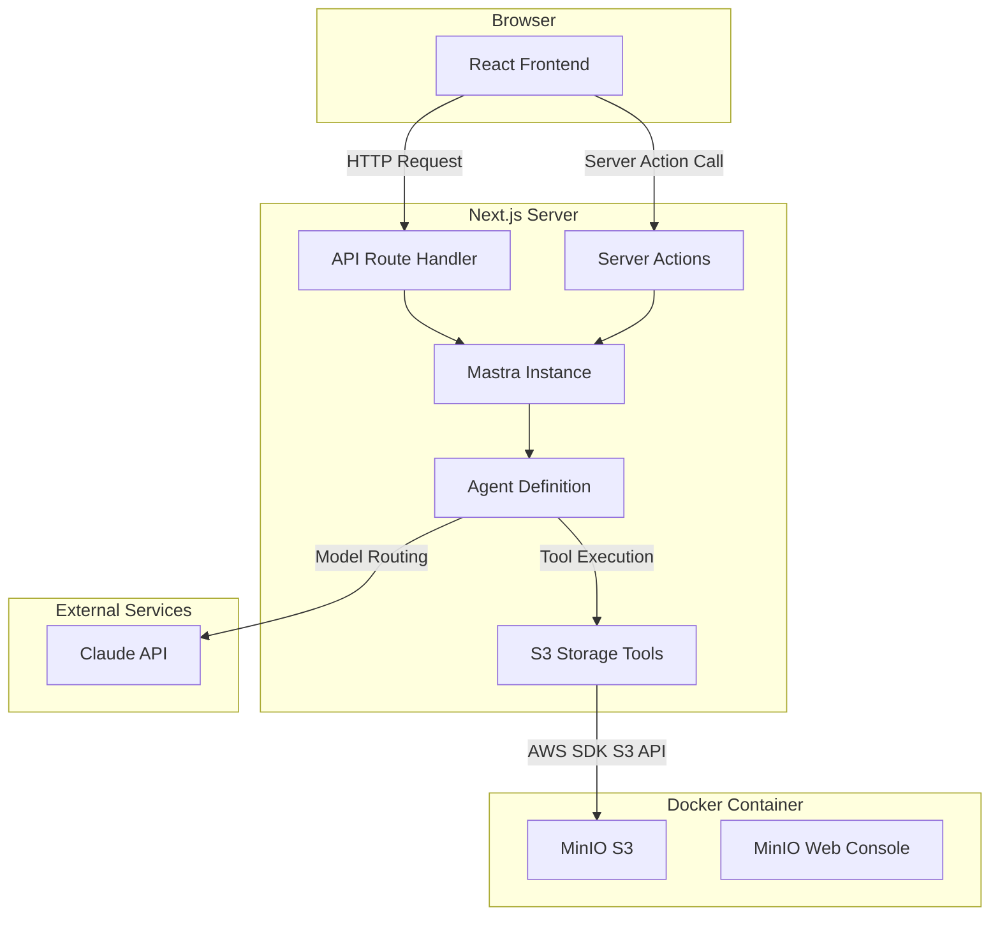
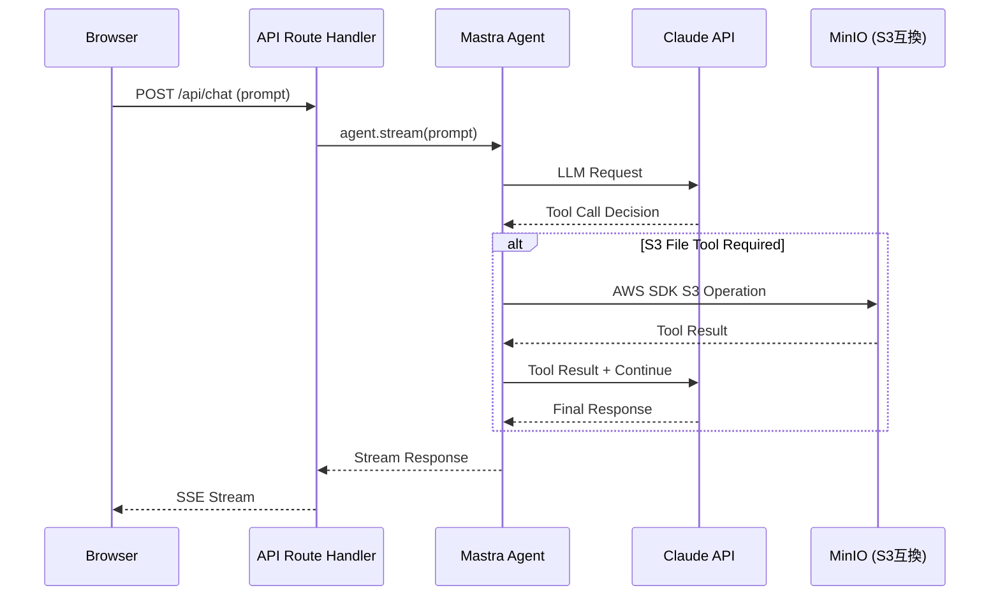
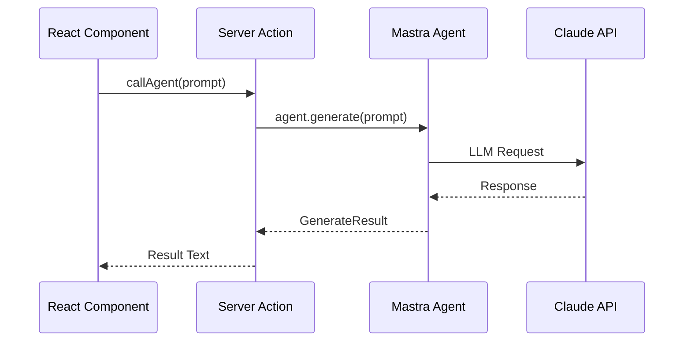

# Technical Design: docker-mastra-claude-env

## Overview

**Purpose**: 本機能は、Next.jsアプリケーション内にMastraフレームワークとClaude APIを統合し、S3互換ストレージ（MinIO）によるファイル管理を含むAIエージェント開発環境を提供する。

**Users**: 開発者が、Next.jsのサーバーサイド（API Routes/Server Actions）からMastra Agentを呼び出し、AIエージェントの構築・テスト・反復開発を行うために利用する。

**Impact**: Next.jsはローカルで実行し、MinIOはDockerで実行するハイブリッド構成で、フロントエンド・バックエンド・AIエージェント・ファイルストレージを統合した開発環境を構築する。

### Goals
- Next.js + Mastra + Claude APIの一体型開発環境を`pnpm dev`で起動可能にする
- S3互換ファイル管理をAWS SDK経由で実現し、Mastraエージェントのツールとして利用可能にする
- Docker上のMinIOでS3互換ストレージをローカルに提供し、外部クラウド依存を排除する
- 環境変数による安全な秘密情報管理と、新規開発者が容易にセットアップ可能なDXを提供する

### Non-Goals
- 本番デプロイ環境の構築（CI/CD、クラウドデプロイ）
- 本番AWS S3への直接接続（開発環境はMinIOのみ）
- 複数AIプロバイダーの並列サポート（Anthropic/Claudeのみ）
- S3以外の外部ストレージサービス連携
- ユーザー認証・認可の実装（開発環境のため不要）

## Architecture

> 詳細な調査ノートは`research.md`を参照。本セクションでは設計判断とコントラクトを自己完結的に記載する。

### Architecture Pattern & Boundary Map

**選択パターン**: Direct Integration（Mastra-in-Next.js一体型）+ Docker MinIO

Next.jsプロジェクト内にMastraを直接統合し、サーバーサイドからエージェントを呼び出す。ファイルストレージはDocker上のMinIO（S3互換）で提供する。



**Architecture Integration**:
- **選択パターン**: Direct Integration + Docker MinIO。Next.jsは`pnpm dev`でローカル起動、MinIOは`docker compose up`でDocker起動
- **ドメイン/機能境界**: (1) UIレイヤー（React）、(2) APIレイヤー（Route Handlers/Server Actions）、(3) AIレイヤー（Mastra Agent/S3 Tools）、(4) インフラレイヤー（Docker MinIO）の4層に分離
- **新コンポーネントの根拠**: Mastraインスタンス初期化、エージェント定義、S3ツール設定、MinIO Docker構成はそれぞれ独立した責務を持つ

### Technology Stack

| Layer | Choice / Version | Role in Feature | Notes |
|-------|------------------|-----------------|-------|
| Frontend | Next.js 16.1.x / React 19.x | UIフレームワーク、App Router | `create-next-app@latest`で初期化（2026年2月時点の最新安定版: 16.1.6） |
| Frontend UI | Tailwind CSS 4.x | スタイリング | Next.js標準統合 |
| Backend | Next.js API Routes / Server Actions | AIエージェント呼び出しのエンドポイント | サーバーサイド専用 |
| AI Framework | Mastra 1.6.x (`@mastra/core`) | エージェント定義・ツール管理 | `npx mastra@latest init`で初期化 |
| AI SDK | `@mastra/ai-sdk` / `@ai-sdk/react` / `ai` | ストリーミングUI・チャットフック | `useChat()`フック使用 |
| AI Model | Anthropic Claude (`anthropic/claude-sonnet-4-20250514`) | LLMモデルプロバイダー | `ANTHROPIC_API_KEY`環境変数で認証 |
| Storage SDK | `@aws-sdk/client-s3` | S3互換ストレージアクセス | MinIOエンドポイントに接続 |
| Storage | MinIO (Docker) | S3互換ローカルストレージ | `docker compose up`で起動 |
| Package Manager | pnpm | 依存関係管理 | `packageManager`フィールド定義 |
| Linter | ESLint 9.x | コード品質 | Next.js標準統合 |
| Formatter | Prettier 3.x + eslint-config-prettier | コードフォーマット | ESLintとの競合回避設定込み |
| Language | TypeScript 5.x | 型安全性 | strictモード |
| Infrastructure | ローカル（Next.js） + Docker（MinIO） | 開発環境 | ハイブリッド構成 |

## System Flows

### エージェント呼び出しフロー（ストリーミング）



**Key Decisions**:
- ストリーミングレスポンスはRoute Handler（`POST /api/chat`）で処理し、`createUIMessageStreamResponse()`を使用
- ツール呼び出しはMastraの`maxSteps`設定で反復回数を制御

### Server Actionによるエージェント呼び出しフロー（非ストリーミング）



**Key Decisions**:
- 非ストリーミングの単発呼び出しにはServer Actionsを使用し、型安全性を確保

## Requirements Traceability

| Requirement | Summary | Components | Interfaces | Flows |
|-------------|---------|------------|------------|-------|
| 1.1 | Next.js App Router基本構成 | ProjectScaffold | - | - |
| 1.2 | TypeScript設定 | ProjectScaffold | - | - |
| 1.3 | `pnpm dev`で開発サーバー起動 | ProjectScaffold | - | - |
| 1.4 | pnpmパッケージマネージャー | ProjectScaffold | - | - |
| 1.5 | tsconfig.json設定 | ProjectScaffold | - | - |
| 2.1 | Mastra依存関係定義 | ProjectScaffold, MastraConfig | - | - |
| 2.2 | エージェント定義テンプレート | AgentDefinition | AgentService | - |
| 2.3 | Route HandlerからAgent呼び出し | ChatRouteHandler | ChatAPI | ストリーミングフロー |
| 2.4 | Server ActionsからAgent呼び出し | AgentServerAction | AgentActionService | Server Actionフロー |
| 2.5 | Mastraインスタンスのサーバーサイド分離 | MastraConfig | MastraService | - |
| 2.6 | サンプルUI | ChatUI | - | ストリーミングフロー |
| 3.1 | Claude APIキーの環境変数管理 | EnvConfig | - | - |
| 3.2 | `.env.local`サポート | EnvConfig | - | - |
| 3.3 | AnthropicモデルプロバイダーとしてClaude設定 | AgentDefinition | AgentService | - |
| 3.4 | APIキー未設定時の警告 | EnvValidation | - | - |
| 3.5 | `.env.local`のGit除外 | GitIgnoreConfig | - | - |
| 3.6 | Claude APIサンプルエージェント | AgentDefinition | AgentService | ストリーミングフロー |
| 4.1 | MinIO Docker構成 | MinIODockerConfig | - | - |
| 4.2 | MinIO起動 | MinIODockerConfig | - | - |
| 4.3 | MinIO Webコンソール公開 | MinIODockerConfig | - | - |
| 4.4 | S3接続情報の環境変数管理 | EnvConfig, S3ToolConfig | - | - |
| 4.5 | S3ファイル操作ツール定義 | S3ToolConfig | S3ToolService | - |
| 4.6 | S3基本操作サンプル | S3ToolConfig, AgentDefinition | S3ToolService | ストリーミングフロー |
| 4.7 | S3接続情報未設定時の警告 | EnvValidation | - | - |
| 4.8 | デフォルトバケット自動作成 | MinIODockerConfig | - | - |
| 5.1 | `.env.example`ファイル | EnvConfig | - | - |
| 5.2 | サーバー/クライアント環境変数の区別 | EnvConfig | EnvSchema | - |
| 5.3 | 環境変数のデフォルト値・説明 | EnvConfig | - | - |
| 5.4 | 秘密情報の`.gitignore`除外 | GitIgnoreConfig | - | - |
| 6.1 | READMEドキュメント | Documentation | - | - |
| 6.2 | `pnpm dev`で全機能同時起動 | ProjectScaffold, MastraConfig | - | - |
| 6.3 | ホットリロード（Fast Refresh） | ProjectScaffold | - | - |
| 6.4 | ESLint/Prettier設定 | ProjectScaffold | - | - |
| 6.5 | `pnpm install`で全依存関係インストール | ProjectScaffold | - | - |
| 6.6 | `docker compose down`で停止 | MinIODockerConfig | - | - |
| 6.7 | MinIOデータ永続化 | MinIODockerConfig | - | - |

## Components and Interfaces

| Component | Domain/Layer | Intent | Req Coverage | Key Dependencies (P0/P1) | Contracts |
|-----------|-------------|--------|--------------|--------------------------|-----------|
| ProjectScaffold | Infrastructure | Next.js + pnpmプロジェクト基盤構成 | 1.1-1.5, 2.1, 6.2-6.5 | Next.js (P0), pnpm (P0) | - |
| MastraConfig | AI / Configuration | Mastraインスタンス初期化・サーバーサイド分離 | 2.1, 2.5, 6.2 | @mastra/core (P0) | Service |
| AgentDefinition | AI / Agent | Claude搭載サンプルエージェント定義 | 2.2, 3.3, 3.6, 4.6 | MastraConfig (P0), S3ToolConfig (P0) | Service |
| S3ToolConfig | AI / Integration | S3ファイル操作ツール定義 | 4.4-4.7 | @aws-sdk/client-s3 (P0), MastraConfig (P0) | Service |
| MinIODockerConfig | Infrastructure / Docker | MinIO Docker構成・起動 | 4.1-4.3, 4.8, 6.6-6.7 | Docker (P0) | - |
| ChatRouteHandler | API / Endpoint | ストリーミングチャットAPI | 2.3, 2.6 | AgentDefinition (P0) | API |
| AgentServerAction | API / Action | Server Action経由のAgent呼び出し | 2.4 | AgentDefinition (P0) | Service |
| ChatUI | UI / Page | チャットインターフェースサンプル | 2.6 | ChatRouteHandler (P0) | State |
| EnvConfig | Infrastructure / Config | 環境変数テンプレート・スキーマ | 3.1-3.2, 4.4, 5.1-5.3 | - | - |
| EnvValidation | Infrastructure / Config | 環境変数バリデーション・警告 | 3.4, 4.7 | EnvConfig (P0) | Service |
| GitIgnoreConfig | Infrastructure / Config | Gitセキュリティ除外設定 | 3.5, 5.4 | - | - |
| Documentation | Infrastructure / Docs | READMEセットアップドキュメント | 6.1 | - | - |

### Infrastructure / Docker Layer

#### MinIODockerConfig

| Field | Detail |
|-------|--------|
| Intent | Docker ComposeでMinIO S3互換ストレージを提供し、開発環境のファイルストレージ基盤を構成する |
| Requirements | 4.1, 4.2, 4.3, 4.8, 6.6, 6.7 |

**Responsibilities & Constraints**
- `docker-compose.yml`でMinIOサービスを定義
- S3 APIエンドポイント（ポート9000）とWebコンソール（ポート9001）の公開
- Dockerボリュームによるデータ永続化
- 起動時のデフォルトバケット自動作成（MinIO Client `mc`を使用するinitコンテナまたはentrypoint設定）

**Dependencies**
- External: Docker / Docker Compose (P0)
- External: MinIO Docker Image (`minio/minio`) (P0)

**Contracts**: Service [ ] / API [ ] / Event [ ] / Batch [ ] / State [ ]

docker-compose.yml構成:
```yaml
services:
  minio:
    image: minio/minio
    ports:
      - "9000:9000"  # S3 API
      - "9001:9001"  # Web Console
    environment:
      MINIO_ROOT_USER: minioadmin
      MINIO_ROOT_PASSWORD: minioadmin
    volumes:
      - minio-data:/data
    command: server /data --console-address ":9001"

  minio-init:
    image: minio/mc
    depends_on:
      minio:
        condition: service_started
    entrypoint: >
      /bin/sh -c "
      sleep 3;
      mc alias set local http://minio:9000 minioadmin minioadmin;
      mc mb local/default-bucket --ignore-existing;
      "

volumes:
  minio-data:
```

**Implementation Notes**
- Integration: Next.jsアプリからは`http://localhost:9000`でMinIO S3 APIにアクセス
- Validation: `docker compose up`で起動確認、`http://localhost:9001`でWebコンソールアクセス確認
- Risks: Dockerが未インストールの環境では動作しない。READMEに前提条件として記載

### AI / Configuration Layer

#### MastraConfig

| Field | Detail |
|-------|--------|
| Intent | Mastraフレームワークのインスタンスを初期化し、サーバーサイド専用モジュールとして提供する |
| Requirements | 2.1, 2.5, 6.2 |

**Responsibilities & Constraints**
- Mastraインスタンスの一元的な初期化と管理
- サーバーサイド専用モジュールとして分離し、クライアントバンドルへの混入を防止
- エージェント・ツールの登録ハブとして機能

**Dependencies**
- External: `@mastra/core` v1.6.x — Mastraフレームワークコア (P0)
- Outbound: AgentDefinition — エージェント登録 (P0)
- Outbound: S3ToolConfig — S3ツール統合 (P0)

**Contracts**: Service [x] / API [ ] / Event [ ] / Batch [ ] / State [ ]

##### Service Interface
```typescript
// src/mastra/index.ts
import { Mastra } from "@mastra/core";
import { Agent } from "@mastra/core/agent";

interface MastraConfigModule {
  /** Mastraインスタンスを取得する。サーバーサイド専用。 */
  readonly mastra: Mastra;
  /** 登録済みエージェントを取得する */
  getAgent(agentId: string): Agent;
}
```
- Preconditions: Node.js環境（サーバーサイド）で実行されること
- Postconditions: Mastraインスタンスが初期化され、全エージェントとS3ツールが利用可能
- Invariants: クライアントサイドからimportされないこと

**Implementation Notes**
- Integration: `next.config.ts`で`serverExternalPackages: ["@mastra/*"]`を設定し、Mastraパッケージをサーバーサイドexternalとして扱う
- Validation: インスタンス生成時にエージェント・ツール登録の整合性を確認
- Risks: Next.jsのバンドラーがMastraパッケージを誤ってクライアントにバンドルする可能性。`serverExternalPackages`設定で軽減

#### AgentDefinition

| Field | Detail |
|-------|--------|
| Intent | Claude APIを使用するサンプルエージェントを定義し、S3ファイル操作ツールを統合する |
| Requirements | 2.2, 3.3, 3.6, 4.6 |

**Responsibilities & Constraints**
- `Agent`クラスを使用したサンプルエージェントの定義
- Anthropic/Claudeモデルの設定（モデル文字列指定）
- S3ファイル操作ツールのエージェントへの注入
- システムプロンプト（instructions）の定義

**Dependencies**
- Inbound: MastraConfig — エージェント登録先 (P0)
- Inbound: ChatRouteHandler — ストリーミング呼び出し元 (P0)
- Inbound: AgentServerAction — 非ストリーミング呼び出し元 (P0)
- External: Claude API (`anthropic/claude-sonnet-4-20250514`) — LLMプロバイダー (P0)
- Outbound: S3ToolConfig — S3ツール取得 (P0)

**Contracts**: Service [x] / API [ ] / Event [ ] / Batch [ ] / State [ ]

##### Service Interface
```typescript
// src/mastra/agents/sample-agent.ts
import { Agent } from "@mastra/core/agent";

/**
 * サンプルエージェント設定
 * - model: Anthropic Claude（環境変数ANTHROPIC_API_KEYで認証）
 * - tools: S3ファイル操作ツール
 */
interface AgentConfig {
  /** エージェントID */
  readonly id: string;
  /** エージェント表示名 */
  readonly name: string;
  /** システムプロンプト */
  readonly instructions: string;
  /** モデル文字列（例: "anthropic/claude-sonnet-4-20250514"） */
  readonly model: string;
  /** 利用可能なツール */
  readonly tools: Record<string, unknown>;
}
```
- Preconditions: `ANTHROPIC_API_KEY`環境変数が設定されていること
- Postconditions: エージェントがClaude APIを通じてテキスト生成・ツール実行可能な状態
- Invariants: モデル文字列は`anthropic/`プレフィックスで始まること

**Implementation Notes**
- Integration: S3ToolConfigから取得したツールを`tools`パラメータに渡す。Mastra `createTool()`で定義したツールをスプレッド構文で統合
- Validation: エージェント生成時にモデル文字列の形式を暗黙的に検証（Mastra内部）
- Risks: Claude APIのレート制限。開発環境では問題にならないが、ドキュメントで注意喚起

#### S3ToolConfig

| Field | Detail |
|-------|--------|
| Intent | AWS SDK（`@aws-sdk/client-s3`）を使用してS3ファイル操作ツールを定義し、エージェントに提供する |
| Requirements | 4.4, 4.5, 4.6, 4.7 |

**Responsibilities & Constraints**
- `@aws-sdk/client-s3`を使用したS3クライアントの初期化（MinIOエンドポイント向け）
- 環境変数（`S3_ENDPOINT`、`S3_ACCESS_KEY_ID`、`S3_SECRET_ACCESS_KEY`、`S3_BUCKET_NAME`）の参照
- Mastra `createTool()`によるS3操作ツールの定義とエージェントへの提供
- ファイル一覧取得、ファイル読み取り、ファイルアップロードのサンプルツール

**Dependencies**
- External: `@aws-sdk/client-s3` — AWS S3 SDK (P0)
- Inbound: AgentDefinition — ツール取得 (P0)
- Inbound: MastraConfig — インスタンス登録 (P0)

**Contracts**: Service [x] / API [ ] / Event [ ] / Batch [ ] / State [ ]

##### Service Interface
```typescript
// src/mastra/tools/s3.ts
import { createTool } from "@mastra/core/tools";
import { z } from "zod";

/** S3 ファイル一覧取得ツール */
const s3ListObjectsTool = createTool({
  id: "s3-list-objects",
  description: "S3バケット内のオブジェクト一覧を取得する",
  inputSchema: z.object({
    prefix: z.string().optional().describe("プレフィックス（フォルダパス）"),
    maxKeys: z.number().optional().default(20).describe("取得件数"),
  }),
  outputSchema: z.object({
    objects: z.array(z.object({
      key: z.string(),
      size: z.number(),
      lastModified: z.string(),
    })),
  }),
  execute: async ({ context }) => {
    // S3Client.send(new ListObjectsV2Command(...))
  },
});

/** S3 ファイル読み取りツール */
const s3GetObjectTool = createTool({
  id: "s3-get-object",
  description: "S3バケットからファイルの内容を読み取る",
  inputSchema: z.object({
    key: z.string().describe("オブジェクトキー（ファイルパス）"),
  }),
  outputSchema: z.object({
    content: z.string(),
    contentType: z.string(),
    size: z.number(),
  }),
  execute: async ({ context }) => {
    // S3Client.send(new GetObjectCommand(...))
  },
});

/** S3 ファイルアップロードツール */
const s3PutObjectTool = createTool({
  id: "s3-put-object",
  description: "S3バケットにファイルをアップロードする",
  inputSchema: z.object({
    key: z.string().describe("オブジェクトキー（ファイルパス）"),
    content: z.string().describe("ファイル内容"),
    contentType: z.string().optional().default("text/plain").describe("Content-Type"),
  }),
  outputSchema: z.object({
    key: z.string(),
    success: z.boolean(),
  }),
  execute: async ({ context }) => {
    // S3Client.send(new PutObjectCommand(...))
  },
});

/** エクスポートされるツール群 */
interface S3Tools {
  readonly s3ListObjects: typeof s3ListObjectsTool;
  readonly s3GetObject: typeof s3GetObjectTool;
  readonly s3PutObject: typeof s3PutObjectTool;
}
```
- Preconditions: `S3_ENDPOINT`、`S3_ACCESS_KEY_ID`、`S3_SECRET_ACCESS_KEY`、`S3_BUCKET_NAME`環境変数が設定されていること。MinIOコンテナが起動していること
- Postconditions: `s3-list-objects`、`s3-get-object`、`s3-put-object`ツールが利用可能
- Invariants: S3クライアントはサーバーサイドでのみ初期化されること

**Implementation Notes**
- Integration: `S3Client`を`{ endpoint: process.env.S3_ENDPOINT, forcePathStyle: true }`で初期化。MinIOはPath Style必須
- Validation: 環境変数未設定時は`EnvValidation`コンポーネントが警告を出力し、ツール初期化をスキップ
- Risks: MinIOコンテナ未起動時はS3操作が失敗する。エラーメッセージで`docker compose up`の実行を案内

### API / Endpoint Layer

#### ChatRouteHandler

| Field | Detail |
|-------|--------|
| Intent | ストリーミングチャットAPIエンドポイントを提供する |
| Requirements | 2.3, 2.6 |

**Responsibilities & Constraints**
- `POST /api/chat`エンドポイントでプロンプトを受け取り、ストリーミングレスポンスを返却
- Mastra Agentの`stream()`メソッドを呼び出し、SSEで結果を返す
- `createUIMessageStreamResponse()`を使用したレスポンスフォーマット

**Dependencies**
- Inbound: ChatUI — HTTP POST (P0)
- Outbound: AgentDefinition — エージェントストリーミング呼び出し (P0)

**Contracts**: Service [ ] / API [x] / Event [ ] / Batch [ ] / State [ ]

##### API Contract
| Method | Endpoint | Request | Response | Errors |
|--------|----------|---------|----------|--------|
| POST | `/api/chat` | `{ messages: ChatMessage[] }` | SSE Stream (text/event-stream) | 400 (入力不正), 500 (内部エラー) |

```typescript
// リクエスト型
interface ChatRequest {
  readonly messages: ReadonlyArray<{
    readonly role: "user" | "assistant";
    readonly content: string;
  }>;
}
```

**Implementation Notes**
- Integration: `@mastra/ai-sdk`の`handleChatStream()`または`createUIMessageStreamResponse()`でストリームを生成
- Risks: 長時間ストリーミング時のタイムアウト。開発環境では問題にならないが留意

#### AgentServerAction

| Field | Detail |
|-------|--------|
| Intent | Server Action経由でエージェントの非ストリーミング呼び出しを提供する |
| Requirements | 2.4 |

**Responsibilities & Constraints**
- `"use server"`ディレクティブ付きの非同期関数としてエージェント呼び出しを定義
- `agent.generate()`で完全なレスポンスを取得して返却
- 型安全な入出力インターフェース

**Dependencies**
- Inbound: ChatUI / その他UIコンポーネント — Server Action呼び出し (P0)
- Outbound: AgentDefinition — エージェント生成呼び出し (P0)

**Contracts**: Service [x] / API [ ] / Event [ ] / Batch [ ] / State [ ]

##### Service Interface
```typescript
// src/app/actions/agent.ts
"use server";

interface AgentActionInput {
  readonly prompt: string;
}

interface AgentActionResult {
  readonly text: string;
  readonly success: boolean;
  readonly error?: string;
}

/** Server Action: エージェントにプロンプトを送信し、結果を取得する */
type CallAgentAction = (input: AgentActionInput) => Promise<AgentActionResult>;
```
- Preconditions: サーバーサイドで実行されること（`"use server"`ディレクティブ）
- Postconditions: エージェントの生成結果またはエラーメッセージを返却
- Invariants: クライアントサイドのコンテキストにMastraの依存関係が露出しないこと

**Implementation Notes**
- Integration: `mastra.getAgent("sample-agent")`でエージェントインスタンスを取得し、`generate()`を呼び出す
- Validation: 入力プロンプトの空文字チェック
- Risks: Server Actionsの実行時間制限に注意（デフォルト30秒）

### UI Layer

#### ChatUI

| Field | Detail |
|-------|--------|
| Intent | ストリーミングチャットインターフェースのサンプルを提供する |
| Requirements | 2.6 |

**Responsibilities & Constraints**
- `useChat()`フックを使用したストリーミングチャットUI
- メッセージの送受信表示
- 入力フォームとレスポンス表示

**Dependencies**
- Outbound: ChatRouteHandler — `/api/chat`へのHTTPリクエスト (P0)
- External: `@ai-sdk/react` — `useChat()`フック (P0)

**Contracts**: Service [ ] / API [ ] / Event [ ] / Batch [ ] / State [x]

##### State Management
- State model: `useChat()`フックが管理する`messages`、`input`、`isLoading`状態
- Persistence & consistency: セッション内のみ（永続化なし）
- Concurrency strategy: Reactの状態管理に委任

**Implementation Notes**
- Integration: `useChat({ api: "/api/chat" })`で接続。`@ai-sdk/react`提供のフックを使用
- Risks: なし（サンプルUIのため）

### Infrastructure / Config Layer

#### EnvConfig

| Field | Detail |
|-------|--------|
| Intent | 環境変数のテンプレートとスキーマを定義する |
| Requirements | 3.1, 3.2, 4.4, 5.1, 5.2, 5.3 |

**Responsibilities & Constraints**
- `.env.example`ファイルによる環境変数テンプレートの提供
- サーバー専用変数（プレフィックスなし）とクライアント公開変数（`NEXT_PUBLIC_`）の区別
- 各環境変数の説明とデフォルト値の記載

**Dependencies**
- なし（静的設定ファイル）

**Contracts**: Service [ ] / API [ ] / Event [ ] / Batch [ ] / State [ ]

環境変数一覧:

| 変数名 | 用途 | 必須 | デフォルト | Scope |
|--------|------|------|-----------|-------|
| `ANTHROPIC_API_KEY` | Claude APIキー | Yes | - | Server |
| `S3_ENDPOINT` | S3/MinIOエンドポイントURL | Yes | `http://localhost:9000` | Server |
| `S3_ACCESS_KEY_ID` | S3/MinIOアクセスキー | Yes | `minioadmin` | Server |
| `S3_SECRET_ACCESS_KEY` | S3/MinIOシークレットキー | Yes | `minioadmin` | Server |
| `S3_BUCKET_NAME` | S3バケット名 | Yes | `default-bucket` | Server |
| `S3_REGION` | S3リージョン | No | `us-east-1` | Server |

**Implementation Notes**
- Integration: Next.jsは`.env.local`を自動読み込み。`NEXT_PUBLIC_`プレフィックスなしの変数はサーバーサイドのみで利用可能
- MinIO開発環境のデフォルト値を`.env.example`に記載し、即座に利用可能な状態を提供

#### EnvValidation

| Field | Detail |
|-------|--------|
| Intent | 必須環境変数の存在を検証し、未設定時に警告を出力する |
| Requirements | 3.4, 4.7 |

**Responsibilities & Constraints**
- サーバー起動時に必須環境変数の存在チェック
- 未設定の場合はコンソールに警告メッセージを出力
- アプリケーションの起動自体はブロックしない（S3連携のみ無効化）

**Dependencies**
- Inbound: MastraConfig — 初期化時に呼び出し (P0)
- Outbound: EnvConfig — 環境変数スキーマ参照 (P0)

**Contracts**: Service [x] / API [ ] / Event [ ] / Batch [ ] / State [ ]

##### Service Interface
```typescript
// src/lib/env-validation.ts

interface EnvValidationResult {
  readonly isValid: boolean;
  readonly warnings: ReadonlyArray<string>;
  readonly missingRequired: ReadonlyArray<string>;
}

interface EnvValidationService {
  /** 全環境変数を検証し、結果を返す */
  validateEnv(): EnvValidationResult;
  /** コンソールに警告メッセージを出力する */
  logWarnings(result: EnvValidationResult): void;
}
```
- Preconditions: サーバーサイドの初期化フェーズで実行されること
- Postconditions: 検証結果が返却され、不足変数が警告として出力される
- Invariants: 環境変数のバリデーション結果はアプリケーション起動をブロックしない（警告のみ）

**Implementation Notes**
- Integration: `src/mastra/index.ts`の初期化コードから呼び出す
- Validation: `ANTHROPIC_API_KEY`未設定は重大警告、S3系変数未設定はS3機能の無効化警告
- Risks: 環境変数名のタイプミスは検出できない

#### GitIgnoreConfig

| Field | Detail |
|-------|--------|
| Intent | 秘密情報ファイルをGit管理から除外する |
| Requirements | 3.5, 5.4 |

Summary-onlyコンポーネント。`.gitignore`に以下を追加: `.env.local`、`.env*.local`。

#### ProjectScaffold

| Field | Detail |
|-------|--------|
| Intent | Next.js + pnpm + TypeScriptプロジェクトの基盤を構成する |
| Requirements | 1.1-1.5, 2.1, 6.2-6.5 |

Summary-onlyコンポーネント。`create-next-app@latest`でApp Router + TypeScript + ESLint + Tailwind CSSプロジェクトを生成し、Mastra依存関係を追加。`next.config.ts`に`serverExternalPackages`設定を追加。Prettier 3.x + `eslint-config-prettier`を追加し、ESLintとの競合を回避。`.prettierrc`設定ファイルを提供。

#### Documentation

| Field | Detail |
|-------|--------|
| Intent | READMEにセットアップ手順・トラブルシューティングを記載する |
| Requirements | 6.1 |

Summary-onlyコンポーネント。READMEに以下を記載: 前提条件（Node.js、pnpm、Docker）、インストール手順、MinIO起動手順（`docker compose up -d`）、MinIO Webコンソールアクセス（`http://localhost:9001`）、環境変数設定、Next.js起動方法（`pnpm dev`）、トラブルシューティング。

## Data Models

本機能は永続的なデータモデルを持たない。セッション内のチャット履歴はReact状態（`useChat()`フック）で管理され、サーバーサイドでの永続化は行わない。MinIO内のオブジェクトはDockerボリュームで永続化される。

### Domain Model
- **ChatMessage**: ユーザーとエージェント間のメッセージ（`role`, `content`）
- **AgentResponse**: エージェントの生成結果（`text`, `finishReason`, `usage`）
- **ToolCallResult**: S3ツール実行結果
- **S3Object**: S3オブジェクトメタデータ（`key`, `size`, `lastModified`, `contentType`）

### Data Contracts & Integration

**API Data Transfer**
- リクエスト: `ChatRequest`（メッセージ配列）
- レスポンス: SSEストリーム（`text/event-stream`）
- シリアライゼーション: JSON

## Error Handling

### Error Strategy
- **APIキー未設定**: 起動時の警告 + 実行時のランタイムエラー（Mastra内部で`ANTHROPIC_API_KEY`未設定を検出）
- **MinIO未起動**: S3クライアント接続失敗 + `docker compose up`の実行を案内する警告出力
- **Claude API障害**: エラーレスポンスをクライアントに返却（500）
- **S3操作障害**: ツール実行エラーとしてエージェントに返却（エージェントが代替回答を生成）

### Error Categories and Responses
- **User Errors (4xx)**: 空プロンプト送信 → 400レスポンス、不正なリクエスト形式 → 400レスポンス
- **System Errors (5xx)**: Claude APIタイムアウト → 504、MinIO接続失敗 → 503（S3機能のみ無効化）
- **Configuration Errors**: 環境変数未設定 → コンソール警告、MinIO未起動 → S3機能無効化

### Monitoring
- 開発環境のため、コンソールログによるエラー出力のみ
- Mastraの組み込みロギング機能を活用

## Testing Strategy

### Unit Tests
- `EnvValidation`: 環境変数の検証ロジック（設定済み/未設定のケース）
- `AgentDefinition`: エージェント設定の型安全性と初期化パラメータ
- `ChatRouteHandler`: リクエストバリデーションとエラーハンドリング
- `S3ToolConfig`: S3クライアント初期化とツール定義の型安全性

### Integration Tests
- Mastraインスタンスの初期化とエージェント登録の動作確認
- API Route `/api/chat`へのリクエスト送信とストリーミングレスポンスの受信
- Server Actionの呼び出しとレスポンス取得
- MinIO起動状態でのS3ツール実行（ファイル一覧、読み取り、アップロード）

### E2E Tests
- チャットUIからのメッセージ送信 → エージェント応答の表示
- S3ファイル関連の質問 → S3ツール呼び出し → 結果表示

## Security Considerations

- **APIキー保護**: 全APIキーはサーバーサイド専用環境変数として管理。`NEXT_PUBLIC_`プレフィックスを付与しない
- **`.env.local`のGit除外**: `.gitignore`で確実に除外し、秘密情報のリポジトリ混入を防止
- **MinIOアクセス制限**: MinIOは`localhost`のみでリッスンし、外部ネットワークからアクセスできない設定
- **入力サニタイゼーション**: Route Handlerでリクエストボディのバリデーションを実施
- **S3操作スコープ**: 開発環境では制限なしだが、本番移行時はIAMポリシーで最小権限を適用する旨をドキュメントに記載
