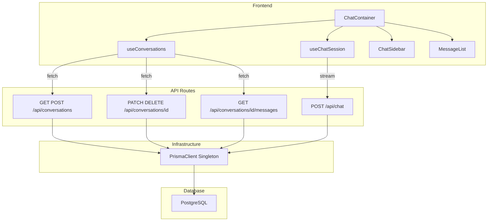
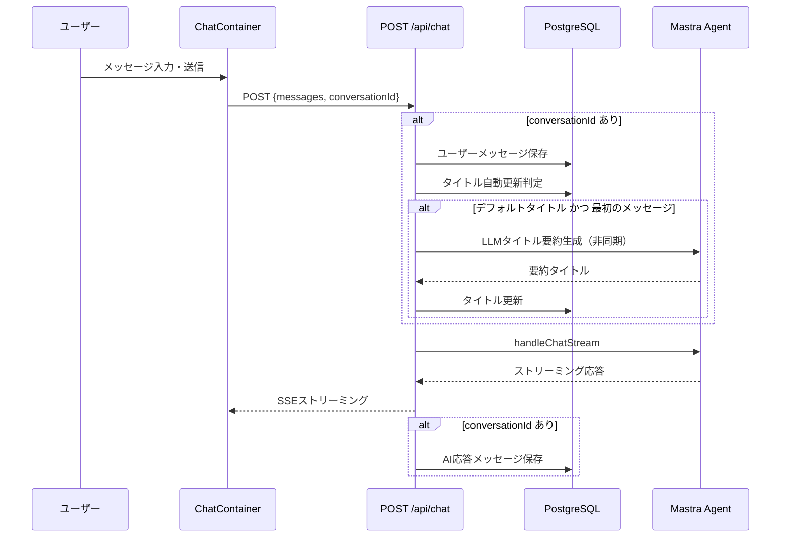
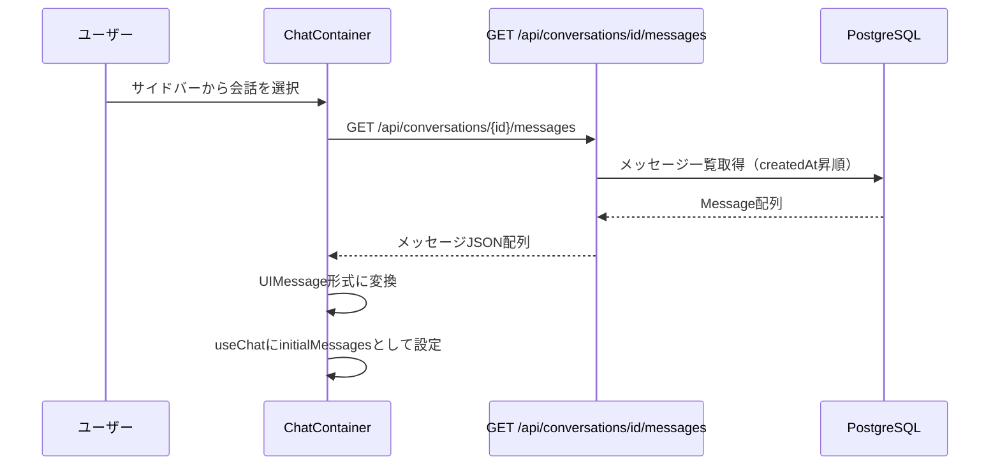
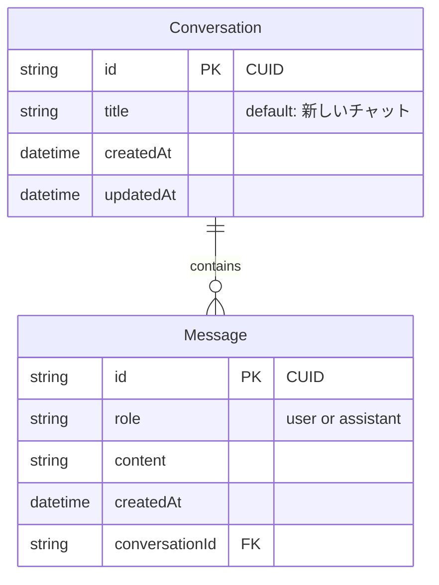

# Technical Design: メッセージ永続化

## Overview

**Purpose**: メッセージ永続化機能は、help-naviチャットアプリケーションのユーザーおよびAI応答メッセージをPostgreSQLデータベースに保存し、会話セッション単位で管理・復元する機能を提供する。

**Users**: チャットを利用する全ユーザーが、ブラウザのリロードやセッション切断後もチャット履歴を継続できる。

**Impact**: 既存のインメモリチャット（ストリーミングのみ）に永続化レイヤーを追加する。`conversationId` パラメータの有無で後方互換性を維持し、既存動作を壊さずに段階的に導入する。

### Goals
- 会話セッション（Conversation）のCRUD操作を提供する
- ユーザーメッセージおよびAI応答メッセージをデータベースに保存する
- 会話選択時にメッセージ履歴を復元し、チャットUIに反映する
- 既存チャットストリーミングとの後方互換性を維持する
- LLMを使用して会話タイトルを自動要約生成する（フォールバック付き）

### Non-Goals
- ユーザー認証・認可（マルチユーザー対応）
- メッセージの全文検索
- 会話のエクスポート/インポート
- 50件を超える会話のページネーション
- リアルタイム通知（WebSocket等）

## Architecture

### Existing Architecture Analysis

現行アーキテクチャは以下の構成で既に部分実装が完了している。

- **フロントエンド**: `ChatContainer`（Container）が `useConversations` と `useChatSession` の2つのカスタムフックを呼び出し、Presentationalコンポーネント群にpropsを分配する
- **バックエンド**: Next.js API Routes（`/api/conversations`, `/api/conversations/[id]`, `/api/conversations/[id]/messages`, `/api/chat`）がPrisma ORM経由でPostgreSQLにアクセスする
- **インフラストラクチャ**: `prisma-client.ts` のシングルトン + globalThisキャッシュパターンが確立済み
- **既知の未完了箇所**: `saveAssistantMessage` 関数が定義済みだが、ストリーム完了コールバックへの接続が未実装

### Architecture Pattern & Boundary Map



**Architecture Integration**:
- Selected pattern: Next.js API Routes + Prisma ORM（既存パターン維持）
- Domain/feature boundaries: `src/features/chat/` がフロントエンド、`src/app/api/` がバックエンド、`src/infrastructure/` がDB接続管理
- Existing patterns preserved: Container/Presentational、globalThisシングルトン、配列ベース環境変数バリデーション
- New components rationale: 新規コンポーネントの追加は不要。既存コンポーネントの拡張のみ
- Steering compliance: `structure.md` の依存方向ルール（上位→下位のみ）、`tech.md` の型安全性原則、`database.md` のPrisma v6パターンに準拠

### Technology Stack

| Layer | Choice / Version | Role in Feature | Notes |
|-------|------------------|-----------------|-------|
| Frontend | React 19.x + `@ai-sdk/react` ^3.x | チャットUI、会話管理フック | `useChat`, `UIMessage` 型を使用 |
| Backend | Next.js 16.x API Routes | 会話・メッセージCRUD、チャットストリーミング | App Router準拠 |
| ORM | Prisma Client ^6.19.x | 型安全なDBアクセス | シングルトンパターン |
| Data | PostgreSQL 17 | 会話・メッセージの永続化 | Docker Compose管理 |
| AI | `@mastra/ai-sdk` ^1.1.x + `ai` ^6.x | ストリーミングチャット | `handleChatStream` + `createUIMessageStreamResponse` |

## System Flows

### メッセージ送信・永続化フロー



ストリーム完了時のAI応答保存は、永続化失敗がストリーミング応答に影響しないよう非同期で実行される。

### 会話復元フロー



## Requirements Traceability

| Requirement | Summary | Components | Interfaces | Flows |
|-------------|---------|------------|------------|-------|
| 1.1 | 新しい会話セッション作成 | ConversationsRoute | POST /api/conversations | - |
| 1.2 | 会話一覧取得（降順50件） | ConversationsRoute, useConversations | GET /api/conversations | - |
| 1.3 | 会話タイトル編集 | ConversationIdRoute, ChatSidebar | PATCH /api/conversations/[id] | - |
| 1.4 | 空タイトルバリデーション | ConversationIdRoute | PATCH /api/conversations/[id] | - |
| 1.5 | 会話・メッセージのカスケード削除 | ConversationIdRoute | DELETE /api/conversations/[id] | - |
| 1.6 | 存在しない会話IDへの404エラー | ConversationIdRoute, MessagesRoute | 全エンドポイント | - |
| 2.1 | ユーザーメッセージ保存 | ChatRoute | POST /api/chat | メッセージ送信フロー |
| 2.2 | AI応答メッセージ保存 | ChatRoute | POST /api/chat | メッセージ送信フロー |
| 2.3 | メッセージフィールド定義 | Prisma Schema | - | - |
| 2.4 | 保存失敗時の非影響保証 | ChatRoute | POST /api/chat | - |
| 3.1 | LLMによるタイトル要約生成（最大30文字） | ChatRoute (generateTitle) | POST /api/chat | メッセージ送信フロー |
| 3.2 | 既変更タイトルの自動生成スキップ | ChatRoute | POST /api/chat | - |
| 3.3 | LLM失敗時の先頭30文字フォールバック | ChatRoute (generateTitle) | POST /api/chat | - |
| 3.4 | タイトル生成の非同期実行 | ChatRoute | POST /api/chat | - |
| 4.1 | メッセージ履歴の昇順取得 | MessagesRoute, useConversations | GET /api/conversations/[id]/messages | 会話復元フロー |
| 4.2 | 取得メッセージのフィールド | MessagesRoute | GET /api/conversations/[id]/messages | - |
| 4.3 | UIでのメッセージレンダリング | ChatContainer, MessageList | - | 会話復元フロー |
| 4.4 | メッセージなしの空配列返却 | MessagesRoute | GET /api/conversations/[id]/messages | - |
| 5.1 | Conversationテーブル定義 | Prisma Schema | - | - |
| 5.2 | Messageテーブル定義 | Prisma Schema | - | - |
| 5.3 | conversationIdインデックス | Prisma Schema | - | - |
| 5.4 | カスケード削除制約 | Prisma Schema | - | - |
| 6.1 | DB接続失敗時のエラー処理 | 全APIルート | 全エンドポイント | - |
| 6.2 | 不正リクエストのバリデーション | ConversationsRoute, ConversationIdRoute, ChatRoute | 全エンドポイント | - |
| 6.3 | 永続化エラーのストリーミング非影響 | ChatRoute | POST /api/chat | - |
| 6.4 | 適切なHTTPステータスコード | 全APIルート | 全エンドポイント | - |
| 7.1 | conversationId未指定時のスキップ | ChatRoute | POST /api/chat | - |
| 7.2 | conversationId指定時の併用実行 | ChatRoute | POST /api/chat | メッセージ送信フロー |

## Components and Interfaces

| Component | Domain/Layer | Intent | Req Coverage | Key Dependencies (P0/P1) | Contracts |
|-----------|--------------|--------|--------------|--------------------------|-----------|
| Prisma Schema | Data | Conversation/Messageモデル定義 | 5.1, 5.2, 5.3, 5.4 | PostgreSQL (P0) | - |
| PrismaClient Singleton | Infrastructure | DB接続管理 | 6.1 | @prisma/client (P0) | Service |
| ConversationsRoute | API | 会話一覧取得・新規作成 | 1.1, 1.2, 6.1, 6.2, 6.4 | PrismaClient (P0) | API |
| ConversationIdRoute | API | 会話タイトル更新・削除 | 1.3, 1.4, 1.5, 1.6, 6.1, 6.2, 6.4 | PrismaClient (P0) | API |
| MessagesRoute | API | メッセージ一覧取得 | 4.1, 4.2, 4.4, 1.6, 6.1, 6.4 | PrismaClient (P0) | API |
| ChatRoute | API | ストリーミング + 永続化統合 | 2.1, 2.2, 2.4, 3.1, 3.2, 6.1, 6.2, 6.3, 6.4, 7.1, 7.2 | PrismaClient (P0), Mastra Agent (P0) | API |
| useConversations | Frontend/Hook | 会話CRUD + ローカルキャッシュ | 1.1, 1.2, 1.3, 1.5, 4.1 | ConversationsRoute (P0), ConversationIdRoute (P0), MessagesRoute (P0) | State |
| useChatSession | Frontend/Hook | AI SDK統合 + conversationId連動 | 7.1, 7.2 | ChatRoute (P0), @ai-sdk/react (P0) | State |
| ChatContainer | Frontend/Container | 状態管理とprops分配 | 4.3 | useConversations (P0), useChatSession (P0) | - |
| ChatSidebar | Frontend/Presentational | 会話一覧表示・操作UI | 1.3, 1.5 | - | - |
| MessageList | Frontend/Presentational | メッセージ表示 | 4.3 | - | - |

### Data Layer

#### Prisma Schema (Conversation / Message)

| Field | Detail |
|-------|--------|
| Intent | 会話セッションとメッセージの永続化スキーマを定義する |
| Requirements | 5.1, 5.2, 5.3, 5.4 |

**Responsibilities & Constraints**
- Conversationモデル: ID（CUID）、タイトル（デフォルト「新しいチャット」）、作成日時、更新日時
- Messageモデル: ID（CUID）、ロール（"user" | "assistant"）、コンテンツ、作成日時、会話ID（外部キー）
- `conversationId` カラムへのインデックス設定
- `onDelete: Cascade` によるカスケード削除制約

**Dependencies**
- External: PostgreSQL 17 -- データストア (P0)

### Infrastructure Layer

#### PrismaClient Singleton

| Field | Detail |
|-------|--------|
| Intent | グローバルに一意のPrismaClientインスタンスを提供し、接続プールを管理する |
| Requirements | 6.1 |

**Responsibilities & Constraints**
- globalThisキャッシュによるHMR時の接続プール枯渇防止
- 環境に応じたログレベル設定（開発: query/error/warn、本番: error）
- 初期化失敗時の詳細エラーメッセージ出力

**Dependencies**
- External: `@prisma/client` ^6.19.x -- ORM (P0)

**Contracts**: Service [x]

##### Service Interface
```typescript
/** prisma-client.ts が export するインターフェース */

/** シングルトンPrismaClientインスタンス */
declare const prisma: PrismaClient;
export { prisma };
```
- Preconditions: `DATABASE_URL` 環境変数が設定されていること
- Postconditions: PrismaClientインスタンスが利用可能であること
- Invariants: プロセスライフサイクル中、同一インスタンスが返却される

### API Layer

#### ConversationsRoute

| Field | Detail |
|-------|--------|
| Intent | 会話一覧の取得と新規会話セッションの作成を提供する |
| Requirements | 1.1, 1.2, 6.1, 6.2, 6.4 |

**Responsibilities & Constraints**
- GET: 更新日時降順で最新50件の会話を返却（id, title, updatedAt）
- POST: デフォルトタイトル「新しいチャット」で新規会話を作成し、201ステータスで返却
- POST: title指定時は空文字バリデーションを実施

**Dependencies**
- Inbound: useConversations -- 会話一覧取得・新規作成 (P0)
- Outbound: PrismaClient -- DB操作 (P0)

**Contracts**: API [x]

##### API Contract

| Method | Endpoint | Request | Response | Errors |
|--------|----------|---------|----------|--------|
| GET | /api/conversations | - | `ConversationListItem[]` | 500 |
| POST | /api/conversations | `{ title?: string }` | `Conversation` | 400, 500 |

```typescript
/** 会話一覧項目の型 */
interface ConversationListItem {
  id: string;
  title: string;
  updatedAt: string;
}

/** 会話エンティティの型 */
interface Conversation {
  id: string;
  title: string;
  createdAt: string;
  updatedAt: string;
}
```

#### ConversationIdRoute

| Field | Detail |
|-------|--------|
| Intent | 個別会話のタイトル更新とカスケード削除を提供する |
| Requirements | 1.3, 1.4, 1.5, 1.6, 6.1, 6.2, 6.4 |

**Responsibilities & Constraints**
- PATCH: タイトルをトリム済みの値に更新。空文字・スペースのみは400エラー
- DELETE: 会話セッションと紐づく全メッセージをカスケード削除
- 両操作: 存在しないIDに対して404エラーを返却

**Dependencies**
- Inbound: useConversations -- タイトル更新・削除操作 (P0)
- Outbound: PrismaClient -- DB操作 (P0)

**Contracts**: API [x]

##### API Contract

| Method | Endpoint | Request | Response | Errors |
|--------|----------|---------|----------|--------|
| PATCH | /api/conversations/[id] | `{ title: string }` | `Conversation` | 400, 404, 500 |
| DELETE | /api/conversations/[id] | - | `{ success: true }` | 404, 500 |

#### MessagesRoute

| Field | Detail |
|-------|--------|
| Intent | 指定した会話に紐づくメッセージ一覧を作成日時昇順で取得する |
| Requirements | 4.1, 4.2, 4.4, 1.6, 6.1, 6.4 |

**Responsibilities & Constraints**
- 会話の存在確認とメッセージ一括取得（N+1防止）
- メッセージは id, role, content, createdAt を含む
- 会話が存在しない場合は404、メッセージが0件の場合は空配列を返却

**Dependencies**
- Inbound: useConversations -- メッセージ取得 (P0)
- Outbound: PrismaClient -- DB操作 (P0)

**Contracts**: API [x]

##### API Contract

| Method | Endpoint | Request | Response | Errors |
|--------|----------|---------|----------|--------|
| GET | /api/conversations/[id]/messages | - | `MessageItem[]` | 404, 500 |

```typescript
/** メッセージ項目の型 */
interface MessageItem {
  id: string;
  role: string;
  content: string;
  createdAt: string;
}
```

#### ChatRoute

| Field | Detail |
|-------|--------|
| Intent | チャットストリーミングとメッセージ永続化を統合し、後方互換性を維持する |
| Requirements | 2.1, 2.2, 2.4, 3.1, 3.2, 6.1, 6.2, 6.3, 6.4, 7.1, 7.2 |

**Responsibilities & Constraints**
- `conversationId` 未指定: 既存のストリーミング動作のみ（後方互換）
- `conversationId` 指定: ユーザーメッセージ保存 → ストリーミング → AI応答保存
- タイトル自動生成: デフォルトタイトル「新しいチャット」かつ最初のメッセージ時にLLMでタイトルを要約生成（失敗時は先頭30文字にフォールバック）
- 永続化失敗はログ出力のみ。ストリーミング応答には影響しない

**Dependencies**
- Inbound: useChatSession -- ストリーミングチャット (P0)
- Outbound: PrismaClient -- DB操作 (P0)
- External: `@mastra/ai-sdk` -- handleChatStream (P0)
- External: `ai` -- createUIMessageStreamResponse (P0)

**Contracts**: API [x]

##### API Contract

| Method | Endpoint | Request | Response | Errors |
|--------|----------|---------|----------|--------|
| POST | /api/chat | `{ messages: Message[], conversationId?: string }` | SSE Stream | 400, 500 |

```typescript
/** チャットリクエストの型 */
interface ChatRequest {
  messages: Array<{
    role: "user" | "assistant";
    content: string;
  }>;
  conversationId?: string;
}
```

**Implementation Notes**
- Integration: `saveAssistantMessage` はストリーム完了を検知して非同期で呼び出す。`@mastra/ai-sdk` のストリームラッピングまたは `onFinish` コールバックの接続方式は実装時に検証する（`research.md` 参照）
- Validation: `messages` フィールドの存在チェックと配列形式バリデーション
- Risks: AI応答保存のストリーム完了検知方式が `@mastra/ai-sdk` の実装に依存する
- Title Generation: LLMによるタイトル要約生成は `generateTitle` 関数として分離し、非同期で実行する。失敗時はユーザーメッセージの先頭30文字にフォールバックする

#### generateTitle 関数設計

```typescript
/**
 * LLMを使用して会話タイトルを生成する
 *
 * Mastraエージェントを通じてClaude APIを呼び出し、
 * ユーザーメッセージの内容を30文字以内のタイトルに要約する。
 * 失敗時はユーザーメッセージの先頭30文字にフォールバック。
 */
async function generateTitle(userMessage: string): Promise<string> {
  try {
    const agent = mastra.getAgent("sample-agent");
    const response = await agent.generate([
      {
        role: "user",
        content: `以下のメッセージ内容を30文字以内の簡潔な会話タイトルに要約してください。タイトルのみを出力し、それ以外の説明は不要です。\n\nメッセージ: ${userMessage}`,
      },
    ]);
    const title = response.text.trim().substring(0, TITLE_MAX_LENGTH);
    return title || userMessage.substring(0, TITLE_MAX_LENGTH);
  } catch (error) {
    console.error("LLMタイトル生成エラー:", error);
    return userMessage.substring(0, TITLE_MAX_LENGTH);
  }
}
```

**設計判断**:
- 既存の `sample-agent` を再利用し、新規エージェント定義は不要
- `agent.generate()` による非ストリーミング呼び出しでタイトルを生成
- タイトル生成はチャットストリーミングをブロックしないよう、`saveUserMessage` 内で非同期実行
- LLM呼び出し失敗時のフォールバック（先頭30文字）により堅牢性を確保

### Frontend / Hooks Layer

#### useConversations

| Field | Detail |
|-------|--------|
| Intent | 会話一覧のCRUD操作とローカルキャッシュ管理を提供するカスタムフック |
| Requirements | 1.1, 1.2, 1.3, 1.5, 4.1 |

**Responsibilities & Constraints**
- 初回マウント時に会話一覧をフェッチ（更新日時降順）
- 作成・削除・更新操作後にローカルキャッシュを楽観的に更新
- 選択中の会話のメッセージを取得し `activeMessages` として保持
- 削除時に選択中の会話が対象の場合、選択をリセット

**Dependencies**
- Outbound: ConversationsRoute -- 会話CRUD (P0)
- Outbound: ConversationIdRoute -- タイトル更新・削除 (P0)
- Outbound: MessagesRoute -- メッセージ取得 (P0)

**Contracts**: State [x]

##### State Management
- State model:
  - `conversations: ConversationListItem[]` -- 会話一覧キャッシュ
  - `activeConversationId: string | null` -- 選択中の会話ID
  - `activeMessages: ConversationMessage[]` -- 選択中会話のメッセージ
  - `isLoading: boolean` -- 初回読み込み状態
- Persistence & consistency: APIレスポンスに基づく楽観的キャッシュ更新
- Concurrency strategy: React stateの自動バッチング（React 19）に依存

```typescript
interface UseConversationsReturn {
  conversations: ConversationListItem[];
  activeConversationId: string | null;
  isLoading: boolean;
  createConversation: () => Promise<string>;
  selectConversation: (id: string) => Promise<void>;
  updateTitle: (id: string, title: string) => Promise<void>;
  deleteConversation: (id: string) => Promise<void>;
  activeMessages: ConversationMessage[];
}
```

#### useChatSession

| Field | Detail |
|-------|--------|
| Intent | @ai-sdk/reactのuseChatをラップし、conversationId連動とメッセージ永続化を管理する |
| Requirements | 7.1, 7.2 |

**Responsibilities & Constraints**
- `conversationId` を `DefaultChatTransport` の body に含めてAPIに送信
- `conversationId` 変更時に Transport を再生成
- `initialMessages`（DB取得済み）を useChat に渡して履歴を復元
- `conversationId` が null の場合、メッセージ送信を無効化

**Dependencies**
- Outbound: ChatRoute -- ストリーミングチャット (P0)
- External: `@ai-sdk/react` -- useChat, UIMessage (P0)
- External: `ai` -- DefaultChatTransport (P0)

**Contracts**: State [x]

##### State Management
- State model: `useChat` が管理する `messages`, `status` を透過的に返却
- Persistence & consistency: `initialMessages` によるDB→UIの状態同期
- Concurrency strategy: `useMemo` による Transport 再生成制御

```typescript
interface UseChatSessionParams {
  conversationId: string | null;
  initialMessages: UIMessage[];
}

interface UseChatSessionReturn {
  messages: UIMessage[];
  status: ChatStatus;
  sendMessage: (text: string) => void;
  stop: () => void;
  regenerate: () => void;
}

type ChatStatus = "submitted" | "streaming" | "ready" | "error";
```

### Frontend / Presentational Layer

ChatContainer, ChatSidebar, MessageList は既存のPresentationalコンポーネントであり、新規の境界を導入しない。Components summary tableの記載内容で十分であるため、詳細ブロックは省略する。

**Implementation Note**: `ChatContainer` は `activeMessages` を `UIMessage[]` 形式に変換する責務を持つ。`role` の型アサーション（`msg.role as "user" | "assistant"`）は、DBスキーマでロール値が制約されている前提に依存する。

## Data Models

### Domain Model



**Business Rules & Invariants**:
- 会話は0件以上のメッセージを持つ
- メッセージのroleは "user" または "assistant" のいずれか
- 会話削除時、紐づく全メッセージがカスケード削除される
- タイトルが「新しいチャット」かつメッセージが0-1件の場合のみ、LLMによる自動タイトル要約生成が実行される（失敗時は先頭30文字にフォールバック）

### Physical Data Model

**Conversationテーブル**:

| Column | Type | Constraints | Notes |
|--------|------|-------------|-------|
| id | String | PK, CUID | `@id @default(cuid())` |
| title | String | NOT NULL | `@default("新しいチャット")` |
| createdAt | DateTime | NOT NULL | `@default(now())` |
| updatedAt | DateTime | NOT NULL | `@updatedAt` |

**Messageテーブル**:

| Column | Type | Constraints | Notes |
|--------|------|-------------|-------|
| id | String | PK, CUID | `@id @default(cuid())` |
| role | String | NOT NULL | "user" or "assistant" |
| content | String | NOT NULL | メッセージ本文 |
| createdAt | DateTime | NOT NULL | `@default(now())` |
| conversationId | String | FK, NOT NULL, INDEX | `@relation(onDelete: Cascade)` |

**Indexes**:
- `Message.conversationId` -- 会話単位でのメッセージ検索を効率化（`@@index([conversationId])`）

**Cascading Rules**:
- `Conversation` 削除時に紐づく `Message` レコードが自動削除（`onDelete: Cascade`）

### Data Contracts & Integration

**API Data Transfer**:
- Request/Response: JSON形式
- 日時フィールド: ISO 8601文字列としてシリアライズ
- IDフィールド: CUIDv1文字列

## Error Handling

### Error Strategy

全APIエンドポイントで統一的なエラーレスポンス形式を採用する。

```typescript
/** エラーレスポンスの型 */
interface ErrorResponse {
  error: string;
}
```

### Error Categories and Responses

**User Errors (4xx)**:
- 400 Bad Request: 空タイトル、不正なリクエストボディ、messages未指定
- 404 Not Found: 存在しない会話IDへのアクセス

**System Errors (5xx)**:
- 500 Internal Server Error: DB接続失敗、予期しない例外

**Graceful Degradation**:
- チャットストリーミング中のメッセージ永続化エラーは `console.error` でログ出力のみ。ストリーミング応答は中断しない（6.3）。
- `saveUserMessage` および `saveAssistantMessage` は個別の try-catch で保護される。

### Monitoring
- 全APIルートで `console.error` によるエラーログ出力
- PrismaClient初期化失敗時の詳細診断メッセージ（接続先URL、対処方法を含む）

## Testing Strategy

### Unit Tests
- `useConversations` フック: 会話CRUD操作、ローカルキャッシュの楽観的更新、エラーハンドリング
- `useChatSession` フック: Transport生成、conversationId連動、sendMessage無効化
- `useSidebar` フック: レスポンシブ状態遷移

### Integration Tests
- POST /api/conversations: 新規会話作成、タイトルバリデーション
- PATCH /api/conversations/[id]: タイトル更新、404エラー、空タイトル拒否
- DELETE /api/conversations/[id]: カスケード削除、404エラー
- GET /api/conversations/[id]/messages: メッセージ取得、空配列、404エラー
- POST /api/chat: conversationId有無による分岐、ユーザーメッセージ保存、LLMタイトル要約生成、LLM失敗時のフォールバック

### E2E Tests
- 新規チャット作成 → メッセージ送信 → ページリロード → 会話選択 → 履歴復元
- サイドバーでの会話タイトル編集
- 会話削除とUI反映
