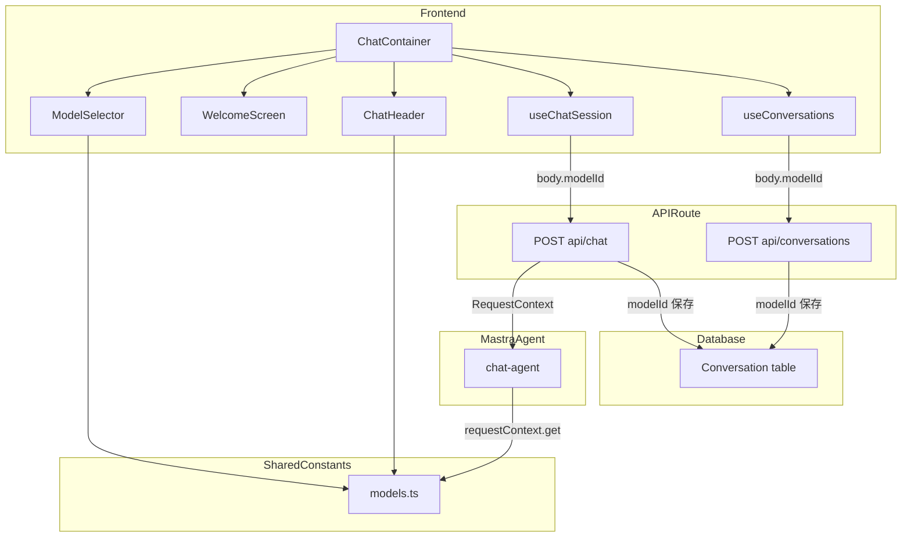
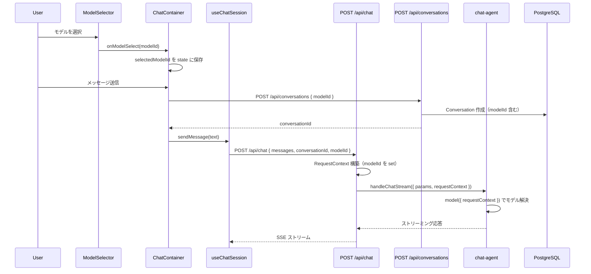
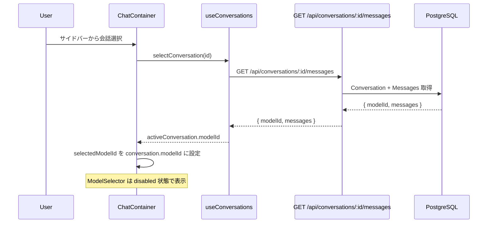
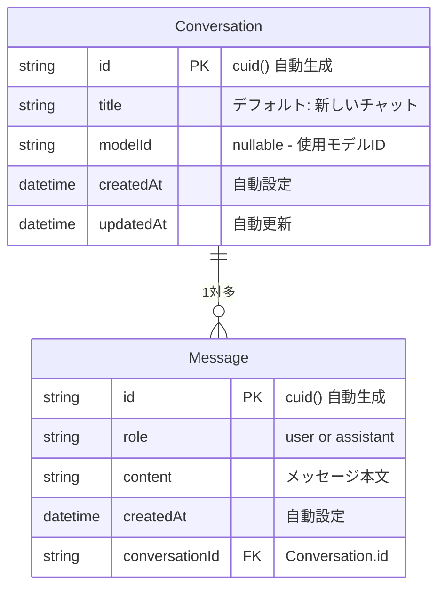
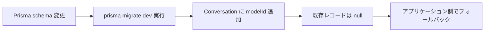

# Design Document: model-selector

## Overview

本機能は、Help Navi アプリケーションのチャット画面において、ユーザーが会話開始前に使用する Anthropic モデルを選択できる UI とバックエンド基盤を提供する。現在はハードコードされた単一モデル（`claude-sonnet-4-20250514`）のみ使用可能だが、本機能によりモデルセレクターを通じた動的なモデル切替を実現する。

**Purpose**: ユーザーがユースケースに応じて最適な AI モデルを選択し、コスト・性能のトレードオフを制御できるようにする。
**Users**: Help Navi の全チャットユーザーが、新規会話開始時にモデルを選択する。
**Impact**: チャットエージェントのモデル指定方式を静的文字列から `requestContext` ベースの動的解決に変更し、Conversation テーブルにモデル情報を永続化する。

### Goals
- 利用可能な Anthropic モデルの一覧表示と選択 UI の提供
- 選択されたモデルによるエージェント応答の動的切替
- 会話単位でのモデル情報の永続化と復元
- 既存会話データとの後方互換性の維持

### Non-Goals
- Anthropic 以外のプロバイダーのモデルサポート
- 会話途中でのモデル変更
- モデルごとの API キー管理やマルチテナント対応
- モデル利用量のトラッキングや課金管理
- API 経由でのモデル一覧動的取得（静的定義で対応）

## Architecture

### Existing Architecture Analysis

現在のチャットシステムは以下の構成で動作する。

- **フロントエンド**: `ChatContainer` （Container）が `useChatSession` / `useConversations` フックを呼び出し、`DefaultChatTransport` 経由で `/api/chat` に POST リクエストを送信
- **API ルート**: `POST /api/chat` が `handleChatStream` を呼び出し、Mastra エージェントのストリーミング応答を SSE で返却
- **エージェント**: `chat-agent.ts` で `model: "anthropic/claude-sonnet-4-20250514"` がハードコード
- **データベース**: `Conversation` テーブルに `id`, `title`, `createdAt`, `updatedAt` カラム。モデル情報は未保持

本機能では、エージェントのモデル指定を動的関数に変更し、フロントエンドからバックエンドへモデル選択情報を伝達するパイプラインを追加する。

### Architecture Pattern & Boundary Map



**Architecture Integration**:
- **Selected pattern**: requestContext による動的モデル解決（Mastra 公式推奨パターン）
- **Domain boundaries**: モデル定義は `src/lib/models.ts` で一元管理し、フロントエンド・バックエンド双方から参照
- **Existing patterns preserved**: Container/Presentational パターン、`DefaultChatTransport` の `body` オプション、`handleChatStream` のパイプライン
- **New components rationale**: `ModelSelector`（UI）と `models.ts`（定数定義）の 2 ファイルのみ新規追加
- **Steering compliance**: 依存方向ルール遵守（`features/` → `lib/`）、TypeScript strict mode、日本語コメント

### Technology Stack

| Layer | Choice / Version | Role in Feature | Notes |
|-------|------------------|-----------------|-------|
| Frontend | React 19 + Tailwind CSS 4 | モデルセレクター UI | 既存スタック |
| Backend | Next.js 16 API Routes | modelId の受け取りと RequestContext 構築 | 既存スタック |
| AI Framework | @mastra/core + @mastra/ai-sdk | requestContext による動的モデル解決 | model 関数形式を活用 |
| Data | Prisma v6.19.x + PostgreSQL | Conversation.modelId の永続化 | nullable String カラム追加 |
| Shared | TypeScript 5.x | モデル定義の型安全な共有 | `src/lib/models.ts` |

## System Flows

### 新規会話でのモデル選択フロー



### 既存会話の再開フロー



## Requirements Traceability

| Requirement | Summary | Components | Interfaces | Flows |
|-------------|---------|------------|------------|-------|
| 1.1 | モデル一覧のセレクター UI 表示 | ModelSelector, models.ts | ModelDefinition 型 | 新規会話フロー |
| 1.2 | モデル名と説明の表示 | ModelSelector, models.ts | AVAILABLE_MODELS 定数 | - |
| 1.3 | デフォルトモデルの事前選択 | ModelSelector, ChatContainer | DEFAULT_MODEL_ID 定数 | 新規会話フロー |
| 2.1 | 選択モデルのハイライト表示 | ModelSelector | ModelSelectorProps | - |
| 2.2 | 選択モデルでの応答生成 | chat-agent, POST /api/chat | RequestContext, model 関数 | 新規会話フロー |
| 2.3 | メッセージ未送信時のセレクター操作可能 | ModelSelector, ChatContainer | ModelSelectorProps.disabled | - |
| 3.1 | 初回メッセージ送信後のセレクター無効化 | ChatContainer, ModelSelector | ModelSelectorProps.disabled | 新規会話フロー |
| 3.2 | 使用中モデル名の表示 | ChatHeader, models.ts | getModelDisplayName | 既存会話再開フロー |
| 3.3 | 既存会話選択時のモデル表示と無効化 | ChatContainer, ChatHeader, useConversations | ConversationListItem.modelId | 既存会話再開フロー |
| 4.1 | モデル識別子の会話データ保存 | POST /api/conversations, POST /api/chat | Conversation.modelId | 新規会話フロー |
| 4.2 | 保存モデルでの応答継続 | POST /api/chat, chat-agent | RequestContext | 既存会話再開フロー |
| 4.3 | 未保存時のデフォルトモデル使用 | chat-agent, models.ts | DEFAULT_MODEL_ID | 既存会話再開フロー |
| 5.1 | 未選択時のデフォルトモデル使用 | chat-agent | model 関数のフォールバック | - |
| 5.2 | 利用不可モデルのエラー表示 | POST /api/chat, ChatContainer | エラーレスポンス | - |

## Components and Interfaces

| Component | Domain/Layer | Intent | Req Coverage | Key Dependencies | Contracts |
|-----------|--------------|--------|--------------|------------------|-----------|
| models.ts | Shared/lib | モデル定義の一元管理 | 1.1, 1.2, 1.3, 3.2, 4.3, 5.1 | なし | Service |
| ModelSelector | UI/Presentational | モデル一覧の表示と選択 | 1.1, 1.2, 1.3, 2.1, 2.3, 3.1 | models.ts (P0) | State |
| ChatContainer | UI/Container | モデル選択状態の管理と伝達 | 1.3, 2.3, 3.1, 3.3, 5.2 | ModelSelector (P0), useChatSession (P0), useConversations (P0) | State |
| useChatSession | Hook | modelId の Transport body 伝達 | 2.2, 4.2 | DefaultChatTransport (P0) | Service |
| useConversations | Hook | 会話の modelId 管理 | 3.3, 4.1 | /api/conversations (P0) | Service |
| ChatHeader | UI/Presentational | 使用中モデル名の表示 | 3.2, 3.3 | models.ts (P1) | State |
| WelcomeScreen | UI/Presentational | モデルセレクターの配置場所 | 1.1 | ModelSelector (P0) | - |
| chat-agent | Mastra/Agent | requestContext による動的モデル解決 | 2.2, 4.2, 4.3, 5.1 | models.ts (P0) | Service |
| POST /api/chat | API/Route | RequestContext 構築とモデルバリデーション | 2.2, 4.1, 4.2, 5.2 | @mastra/core (P0), Prisma (P0) | API |
| POST /api/conversations | API/Route | modelId 付き会話作成 | 4.1 | Prisma (P0) | API |
| Conversation model | Data/Schema | modelId カラムの追加 | 4.1, 4.2, 4.3 | - | - |

### Shared / lib

#### models.ts

| Field | Detail |
|-------|--------|
| Intent | 利用可能な Anthropic モデルの定義と型を一元管理する |
| Requirements | 1.1, 1.2, 1.3, 3.2, 4.3, 5.1 |

**Responsibilities & Constraints**
- 利用可能モデルの定義（ID、表示名、説明）を単一ソースとして管理
- デフォルトモデル ID の定義
- モデル ID からの表示名取得ヘルパー
- フロントエンド・バックエンド双方からインポート可能（`src/lib/` 配置）

**Dependencies**
- Inbound: ModelSelector, ChatHeader, chat-agent, POST /api/chat — モデル情報参照 (P0)
- External: なし

**Contracts**: Service [x]

##### Service Interface

```typescript
/** モデル定義の型 */
interface ModelDefinition {
  /** Mastra で使用するモデル識別子（例: "claude-sonnet-4-20250514"） */
  id: string;
  /** Anthropic プロバイダー付きモデル識別子（例: "anthropic/claude-sonnet-4-20250514"） */
  mastraModelId: string;
  /** UI 表示用のモデル名（例: "Claude Sonnet 4"） */
  displayName: string;
  /** モデルの簡易説明（例: "バランス型。多くのユースケースで推奨"） */
  description: string;
}

/** 利用可能モデル一覧（定数配列） */
const AVAILABLE_MODELS: readonly ModelDefinition[];

/** デフォルトモデルの ID */
const DEFAULT_MODEL_ID: string; // "claude-sonnet-4-20250514"

/** モデル ID から表示名を取得する */
function getModelDisplayName(modelId: string | null): string;

/** モデル ID が有効かどうかを検証する */
function isValidModelId(modelId: string): boolean;
```

**Implementation Notes**
- `AVAILABLE_MODELS` は `as const` で定義し、型推論を最大化
- `mastraModelId` は `anthropic/${id}` 形式で、Agent の model 関数で使用
- `isValidModelId` は API ルートでのバリデーションに使用

### UI / Presentational

#### ModelSelector

| Field | Detail |
|-------|--------|
| Intent | 利用可能なモデルの一覧を表示し、ユーザーのモデル選択を受け付ける |
| Requirements | 1.1, 1.2, 1.3, 2.1, 2.3, 3.1 |

**Responsibilities & Constraints**
- `AVAILABLE_MODELS` からモデル一覧をレンダリング
- 選択状態のハイライト表示
- `disabled` プロパティによる操作可否の制御
- Tailwind CSS によるスタイリング（既存デザインとの一貫性）

**Dependencies**
- Inbound: ChatContainer, WelcomeScreen — 配置と状態制御 (P0)
- Outbound: models.ts — モデル定義参照 (P0)

**Contracts**: State [x]

##### State Management

```typescript
interface ModelSelectorProps {
  /** 現在選択中のモデル ID */
  selectedModelId: string;
  /** モデル選択時のコールバック */
  onModelSelect: (modelId: string) => void;
  /** 操作可否（会話開始後は true） */
  disabled: boolean;
}
```

**Implementation Notes**
- ドロップダウンまたはラジオボタン形式のセレクター UI
- `disabled` 時は選択操作を無効化しつつ、現在のモデル名は表示
- モバイル対応のレスポンシブデザイン

#### ChatHeader（変更）

| Field | Detail |
|-------|--------|
| Intent | 既存のヘッダーに使用中モデル名の表示を追加する |
| Requirements | 3.2, 3.3 |

**Implementation Notes**
- `ChatHeaderProps` に `modelId: string | null` を追加
- `getModelDisplayName` でモデル名を取得し、タイトル近傍に表示
- 既存のレイアウト（タイトル中央配置）を維持

#### WelcomeScreen（変更）

| Field | Detail |
|-------|--------|
| Intent | ウェルカム画面にモデルセレクターを統合する |
| Requirements | 1.1 |

**Implementation Notes**
- `WelcomeScreenProps` に `ModelSelectorProps` の必要フィールドを追加
- ガイダンステキストの下部にモデルセレクターを配置

### UI / Container

#### ChatContainer（変更）

| Field | Detail |
|-------|--------|
| Intent | モデル選択状態の管理と各コンポーネントへの伝達 |
| Requirements | 1.3, 2.3, 3.1, 3.3, 5.2 |

**Responsibilities & Constraints**
- `selectedModelId` の state 管理（デフォルト: `DEFAULT_MODEL_ID`）
- 会話選択時に `conversation.modelId` で `selectedModelId` を更新
- メッセージ有無に基づく `ModelSelector` の `disabled` 制御
- `useChatSession` と `useConversations` への `modelId` 伝達

**Dependencies**
- Outbound: ModelSelector — UI 表示 (P0)
- Outbound: useChatSession — modelId 伝達 (P0)
- Outbound: useConversations — modelId 付き会話作成 (P0)
- Outbound: models.ts — DEFAULT_MODEL_ID 参照 (P0)

**Contracts**: State [x]

##### State Management

```typescript
/** ChatContainer 内の追加 state */
// selectedModelId: string（useState で管理、初期値 DEFAULT_MODEL_ID）

/** ModelSelector の disabled 判定ロジック */
// disabled = messages.length > 0 || (activeConversationId !== null && activeMessages.length > 0)
```

**Implementation Notes**
- 新規会話作成時に `selectedModelId` を `DEFAULT_MODEL_ID` にリセット
- 既存会話選択時に `conversation.modelId ?? DEFAULT_MODEL_ID` で `selectedModelId` を設定
- `createConversation` に `modelId` パラメータを追加

### Hooks

#### useChatSession（変更）

| Field | Detail |
|-------|--------|
| Intent | DefaultChatTransport の body に modelId を含めて API ルートに伝達する |
| Requirements | 2.2, 4.2 |

**Contracts**: Service [x]

##### Service Interface

```typescript
/** 変更後のパラメータ型 */
interface UseChatSessionParams {
  conversationId: string | null;
  initialMessages: UIMessage[];
  /** 使用するモデル ID */
  modelId: string;
}
```

**Implementation Notes**
- `DefaultChatTransport` の `body` に `modelId` を追加
- `transport` の `useMemo` 依存配列に `modelId` を追加

#### useConversations（変更）

| Field | Detail |
|-------|--------|
| Intent | 会話の modelId 情報の取得と会話作成時の modelId 送信 |
| Requirements | 3.3, 4.1 |

**Contracts**: Service [x]

##### Service Interface

```typescript
/** 変更後の ConversationListItem 型 */
interface ConversationListItem {
  id: string;
  title: string;
  updatedAt: string;
  /** 会話で使用するモデル ID（null = デフォルト） */
  modelId: string | null;
}

/** 変更後の createConversation */
// createConversation(modelId?: string): Promise<string>
```

**Implementation Notes**
- `GET /api/conversations` のレスポンスに `modelId` を含める
- `createConversation` に `modelId` パラメータを追加し、POST ボディに含める
- `selectConversation` で取得した会話データから `modelId` を返却

### Mastra / Agent

#### chat-agent（変更）

| Field | Detail |
|-------|--------|
| Intent | requestContext から動的にモデルを解決する |
| Requirements | 2.2, 4.2, 4.3, 5.1 |

**Responsibilities & Constraints**
- `model` プロパティを文字列から関数に変更
- `requestContext` から `modelId` を取得
- 未指定・無効な場合はデフォルトモデルにフォールバック

**Dependencies**
- Inbound: POST /api/chat — requestContext 経由でモデル情報受信 (P0)
- Outbound: models.ts — モデル定義参照・バリデーション (P0)

**Contracts**: Service [x]

##### Service Interface

```typescript
/** 変更後の model プロパティ */
// model: ({ requestContext }) => {
//   const modelId = requestContext?.get("modelId") as string | undefined;
//   const definition = AVAILABLE_MODELS.find(m => m.id === modelId);
//   return definition?.mastraModelId ?? DEFAULT_MASTRA_MODEL_ID;
// }
```

**Implementation Notes**
- `requestContext` が undefined の場合（テスト等）もデフォルトモデルで動作
- `isValidModelId` によるバリデーションを model 関数内で実施

### API / Route

#### POST /api/chat（変更）

| Field | Detail |
|-------|--------|
| Intent | リクエストから modelId を取得し、RequestContext を構築して handleChatStream に渡す |
| Requirements | 2.2, 4.1, 4.2, 5.2 |

**Responsibilities & Constraints**
- `body.modelId` の取得とバリデーション
- `conversationId` がある場合、DB から会話の `modelId` を取得してフォールバック
- `RequestContext` インスタンスの構築と `modelId` の設定
- `handleChatStream` の `params` に `requestContext` を含める
- 初回メッセージ送信時に Conversation の `modelId` を更新（未設定の場合）

**Dependencies**
- External: @mastra/core/request-context — RequestContext クラス (P0)
- Outbound: Prisma — Conversation.modelId 読み書き (P0)
- Outbound: models.ts — isValidModelId バリデーション (P0)

**Contracts**: API [x]

##### API Contract

| Method | Endpoint | Request (変更点) | Response | Errors |
|--------|----------|-----------------|----------|--------|
| POST | /api/chat | `{ messages, conversationId?, modelId? }` | SSE ストリーム | 400 (無効な modelId), 500 |

**Implementation Notes**
- `modelId` の解決優先順位: `body.modelId` > `conversation.modelId` > `DEFAULT_MODEL_ID`
- 無効な `modelId` が指定された場合は 400 エラーを返却
- `RequestContext` の構築は `saveUserMessage` の後、`handleChatStream` の前に実施

#### POST /api/conversations（変更）

| Field | Detail |
|-------|--------|
| Intent | 会話作成時に modelId を保存する |
| Requirements | 4.1 |

**Contracts**: API [x]

##### API Contract

| Method | Endpoint | Request (変更点) | Response | Errors |
|--------|----------|-----------------|----------|--------|
| POST | /api/conversations | `{ title?, modelId? }` | Conversation (modelId 含む) | 400, 500 |

**Implementation Notes**
- `body.modelId` が指定されている場合、`isValidModelId` でバリデーション
- 無効な `modelId` の場合は 400 エラー

#### GET /api/conversations（変更）

**Implementation Notes**
- `select` に `modelId: true` を追加してレスポンスに含める

## Data Models

### Logical Data Model



### Physical Data Model

**Conversation テーブルへの変更**:

```prisma
model Conversation {
  id        String    @id @default(cuid())
  title     String    @default("新しいチャット")
  modelId   String?   // 使用するAnthropicモデルID（null = デフォルトモデル）
  createdAt DateTime  @default(now())
  updatedAt DateTime  @updatedAt
  messages  Message[]
}
```

- `modelId`: nullable String。既存レコードは null（= デフォルトモデル使用）
- インデックス不要（modelId での検索は想定しない）

### Data Contracts & Integration

**API Data Transfer**:

```typescript
/** 会話一覧レスポンス項目（変更後） */
interface ConversationResponse {
  id: string;
  title: string;
  updatedAt: string;
  modelId: string | null;
}
```

## Error Handling

### Error Strategy

| エラー種別 | 条件 | 対応 | ユーザー表示 |
|-----------|------|------|-------------|
| 無効な modelId | `isValidModelId` が false | 400 エラー返却 | エラーメッセージ表示、別モデルの選択を促す |
| modelId 未指定 | body.modelId が undefined | デフォルトモデルを使用 | なし（正常動作） |
| conversation.modelId が null | 既存データとの互換性 | デフォルトモデルにフォールバック | なし（正常動作） |
| requestContext 未設定 | テスト環境等 | デフォルトモデルにフォールバック | なし |

### Error Categories and Responses

**User Errors (400)**:
- 無効な `modelId` → `{ error: "指定されたモデルは利用できません。別のモデルを選択してください。" }`
- フロントエンドで `AVAILABLE_MODELS` からのみ選択可能なため、通常は発生しない（防御的バリデーション）

**System Errors (500)**:
- DB 接続エラー → 既存のエラーハンドリングを踏襲
- Anthropic API エラー → 既存のストリーミングエラーハンドリングを踏襲

## Testing Strategy

### Unit Tests
- `models.ts`: `getModelDisplayName` と `isValidModelId` の各パターン検証
- `ModelSelector`: 選択状態のハイライト、disabled 時の操作無効化、デフォルト選択
- `chat-agent`: model 関数が requestContext から正しくモデルを解決すること

### Integration Tests
- `POST /api/chat`: modelId 付きリクエストで正しいモデルが使用されること
- `POST /api/chat`: 無効な modelId で 400 エラーが返却されること
- `POST /api/conversations`: modelId 付き会話作成と取得
- 会話再開時に保存された modelId で応答が継続されること

### E2E Tests
- 新規会話でモデルを選択し、メッセージ送信後にセレクターが無効化されること
- 既存会話を選択した際に、保存されたモデル名が表示されること
- モデル未選択時にデフォルトモデルで応答が生成されること

## Migration Strategy



- `modelId` は nullable のため、既存データに影響なし
- マイグレーションは `ALTER TABLE` による単一カラム追加のみ
- ロールバック: カラム削除で元に戻せる
- データ移行不要（既存レコードの null はデフォルトモデルとして扱う）
