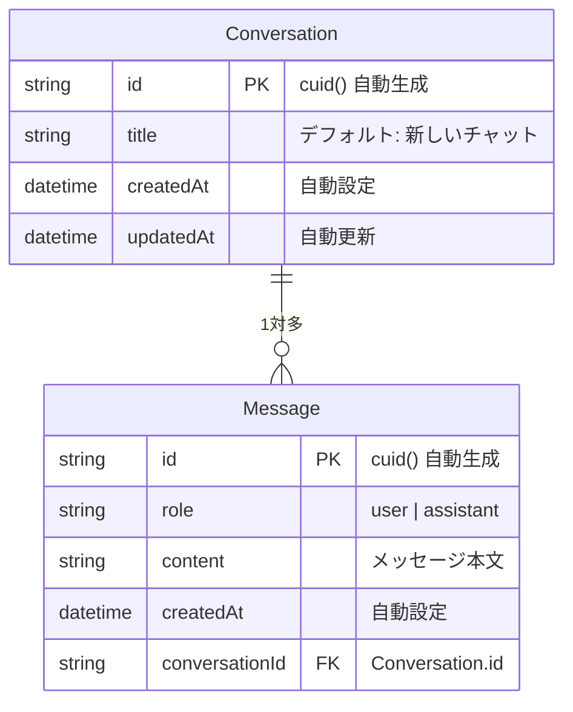

# データベース標準

## データベース概要

PostgreSQLをメインのリレーショナルデータベースとして採用。
ORM にはPrisma v6.x系を使用し、型安全なデータベースアクセスを提供する。

## 技術選定と判断根拠

### Prisma v6.19.x の採用理由
- Prisma 7はESM（ECMAScript Modules）が必須であり、現時点のNext.js構成との互換性に課題があるためv6系を採用
- `@prisma/client` v6.19.x + `prisma` CLI v6.19.x のペアで運用
- 将来的にESM移行が完了した段階でPrisma 7へのアップグレードを検討

### 環境変数バリデーション方式
- Zodスキーマによるバリデーションは**不使用**（プロジェクト既存の配列ベース方式に統一）
- `REQUIRED_ENV_VARS` 配列に `DATABASE_URL` を追加する形で対応
- 起動ブロックせず警告のみ出力する既存方針を踏襲

## ER図



### リレーション詳細

| 親テーブル | 子テーブル | カーディナリティ | 削除ルール |
| --- | --- | --- | --- |
| Conversation | Message | 1:N | CASCADE（会話削除時にメッセージも自動削除） |

### インデックス

| テーブル | カラム | 種類 | 目的 |
| --- | --- | --- | --- |
| Message | `conversationId` | INDEX | 会話IDによるメッセージ検索の高速化 |

## スキーマ設計

### ファイル配置
- スキーマ定義: `prisma/schema.prisma`
- マイグレーション: `prisma/migrations/` （Prisma Migrate管理）

### 命名規約
- テーブル名: PascalCase（Prismaモデル名準拠）
- カラム名: camelCase（Prismaフィールド名準拠）
- リレーション: Prismaの `@relation` ディレクティブで明示

### データソース設定パターン
```prisma
generator client {
  provider = "prisma-client-js"
}

datasource db {
  provider = "postgresql"
  url      = env("DATABASE_URL")
}
```

## クライアント管理パターン

### シングルトンパターン（globalThis）
Next.jsの開発環境ではホットリロード（HMR）時にモジュールが再読み込みされるため、
`globalThis` を使用してPrismaClientインスタンスをキャッシュし、接続プールの枯渇を防止する。

```typescript
// src/infrastructure/prisma-client.ts
import { PrismaClient } from "@prisma/client";

declare global {
  var prisma: PrismaClient | undefined;
}

const prisma: PrismaClient = globalThis.prisma ?? createPrismaClient();

if (process.env.NODE_ENV !== "production") {
  globalThis.prisma = prisma;
}

export { prisma };
```

### ログレベル設定
- 開発環境: `["query", "error", "warn"]`（デバッグ支援）
- 本番環境: `["error"]`（パフォーマンス優先）

### インポート方法
```typescript
import { prisma } from "@/infrastructure/prisma-client";
```

## マイグレーション運用

### スクリプト一覧
```bash
# 開発用マイグレーション作成・適用
pnpm db:migrate:dev

# 本番用マイグレーション適用（既存マイグレーションのみ）
pnpm db:migrate:deploy

# Prisma Client再生成
pnpm db:generate

# Prisma Studio（GUIデータブラウザ）
pnpm db:studio
```

### マイグレーション方針
- `prisma migrate dev` で開発中にスキーマ変更を管理
- マイグレーションファイルはGit管理対象（自動生成SQLをコミット）
- 本番デプロイは `prisma migrate deploy` で未適用マイグレーションのみ実行

## ローカル開発環境

### Docker Compose構成
PostgreSQLはDocker Composeで管理し、既存のMinIOサービスと並列で起動する。

- イメージ: `postgres:17`
- ポート: `5432:5432`
- ヘルスチェック: `pg_isready` コマンド
- データ永続化: `postgres-data` ボリューム

### 開発フロー
1. `pnpm dev`（Docker Compose自動起動 + Next.jsデバッグサーバー）
2. `pnpm db:migrate:dev` でスキーマ変更を反映
3. `pnpm db:studio` でデータ確認（任意）

### 接続情報
- 接続文字列形式: `postgresql://{user}:{password}@{host}:{port}/{database}`
- 環境変数: `DATABASE_URL` で管理（`.env.local` に設定）

## infrastructureレイヤーの一貫性

`src/infrastructure/` 配下で外部サービスクライアントを統一的に管理する。

| ファイル | 外部サービス | パターン |
|---------|-------------|---------|
| `prisma-client.ts` | PostgreSQL | シングルトン + globalThisキャッシュ |
| `s3-client.ts` | MinIO/S3 | ファクトリ関数（リクエスト毎生成） |

---
_created_at: 2026-03-04_
_updated_at: 2026-03-05 - ER図（mermaid形式）、リレーション詳細、インデックス情報を追記_
