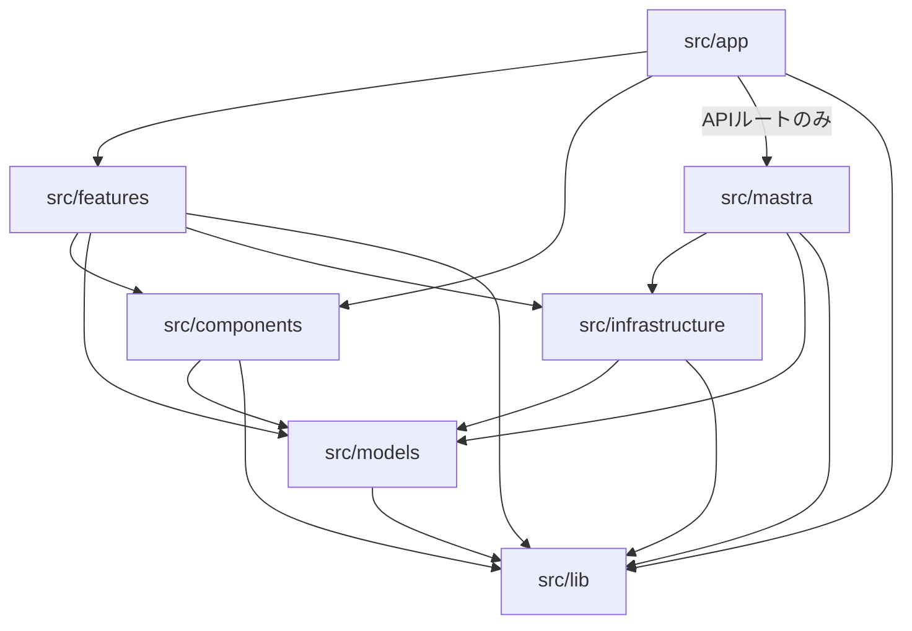

# プロジェクト構造

## ディレクトリ依存関係図



> **原則**: 上位→下位の一方向依存のみ許可。逆方向の依存・feature間の直接依存は禁止。

## 構成方針

Next.js App Router標準のディレクトリ構成に従い、関心事別にモジュールを分離する。
AIエージェント関連のコードは `src/mastra/` に集約し、UIコンポーネント・ページ・ユーティリティはそれぞれ独立したディレクトリに配置する。
機能単位のコードは `src/features/` 配下で管理し、複数機能で共通利用するコンポーネントは `src/components/` に昇格させる。
外部リソースとの連携コードは `src/infrastructure/` に集約し、ドメインモデル・エンティティは `src/models/` で管理する。

## ディレクトリパターン

### アプリケーションルーティング

**場所**: `src/app/`
**用途**: Next.js App Routerのページ、レイアウト、APIルート
**パターン**:

- `page.tsx` / `layout.tsx` - ページとレイアウト
- `api/[機能名]/route.ts` - APIルートハンドラ
  **ルール**:
- `page.tsx` は基本的にサーバーコンポーネント（SSR）として実装すること（`"use client"` を付けない）
- クライアントレンダリングが必要な場合は、`page.tsx` 自体をクライアントコンポーネントにせず、該当部分だけをクライアントコンポーネントとして切り出して `page.tsx` から呼び出す

### 機能モジュール

**場所**: `src/features/[機能名]/`
**用途**: 機能単位でUI・ロジックを管理する
**パターン**:

- `components/` - 機能固有のUIコンポーネント（container / presentational パターンを採用）
- `hooks/` - 機能固有のカスタムフック
  **ルール**:
- features のコンポーネントは基本的に `page.tsx` から呼び出す構成とする
- container コンポーネントがロジック（hooks呼び出し・状態管理）を担当し、presentational コンポーネントは表示に専念する
- hooks は必ず container コンポーネントから呼び出すこと
- 複数の features で同じようなコンポーネントが必要になった場合は `src/components/` に移植して共通化する

### UIコンポーネント（共通）

**場所**: `src/components/`
**用途**: 複数の features で再利用される共通クライアントコンポーネント
**パターン**:

- `"use client"` ディレクティブを先頭に宣言
- kebab-caseのファイル名
- features 間で重複が発生した際にここへ昇格させる

### モデル・エンティティ

**場所**: `src/models/`
**用途**: ドメインモデル、エンティティ、型定義の管理
**パターン**:

- ドメインごとにファイルを分割（例: `user.ts`, `document.ts`）
- 型定義とバリデーションロジックをコロケーション

### インフラストラクチャ

**場所**: `src/infrastructure/`
**用途**: PostgreSQL、S3等の外部リソース操作コードの管理
**パターン**:

- 外部サービスごとにファイルを分割（例: `prisma-client.ts`, `s3-client.ts`）
- 外部SDKの初期化・設定・操作をラップして提供
- PrismaClientはシングルトン + globalThisキャッシュ（ホットリロード対策）

### AIエージェント

**場所**: `src/mastra/`
**用途**: Mastraフレームワーク関連の全コード（サーバーサイド専用）
**パターン**:

- `index.ts` - Mastraインスタンスの初期化とエージェント登録
- `agents/[エージェント名].ts` - 個別エージェント定義
- `tools/[ツール群名].ts` - エージェントツール定義（Zodスキーマ付き）

### ユーティリティ

**場所**: `src/lib/`
**用途**: 共通ヘルパー、バリデーション、設定関連
**パターン**:

- 横断的関心事を配置（例: `env-validation.ts`, `models.ts`）
- 特定の機能に紐づかない汎用ロジック
- フロントエンド・バックエンド双方から利用する共有定義（モデル定義、定数等）

### テスト

**場所**: `__tests__/`（プロジェクトルート）、`src/**/*.test.ts`
**用途**: ユニットテスト・統合テスト
**パターン**:

- ルートの `__tests__/` にタスクベースの統合テストを配置
- `src/` 内にコロケーションされた単体テストも対応

### Prismaスキーマ

**場所**: `prisma/`
**用途**: データベーススキーマ定義とマイグレーション管理
**パターン**:

- `schema.prisma` - データソース設定・モデル定義
- `migrations/` - Prisma Migrate管理のマイグレーションファイル（Git管理対象）

### インフラ設定

**場所**: プロジェクトルート
**用途**: Docker Compose、設定ファイル
**パターン**:

- `docker-compose.yml` - MinIO + PostgreSQL等の開発用サービス定義
- `.env.example` - 環境変数テンプレート

## ディレクトリ間の依存関係

上位から下位への依存のみ許可し、逆方向の依存は禁止する。

| 依存元                | 依存先（許可）                                               | 備考                                                        |
| --------------------- | ------------------------------------------------------------ | ----------------------------------------------------------- |
| `src/app/`            | `features/`, `components/`, `mastra/`(APIルートのみ), `lib/` | ページからfeaturesを呼び出す。mastraはAPIルートからのみ参照 |
| `src/features/`       | `components/`, `models/`, `infrastructure/`, `lib/`          | 他のfeatureへの直接依存は禁止                               |
| `src/components/`     | `models/`, `lib/`                                            | features・infrastructure への依存は禁止                     |
| `src/models/`         | `lib/`                                                       | 他ディレクトリへの依存は禁止（最下層）                      |
| `src/infrastructure/` | `models/`, `lib/`                                            | features・components への依存は禁止                         |
| `src/mastra/`         | `infrastructure/`, `models/`, `lib/`                         | features・components への依存は禁止                         |
| `src/lib/`            | なし                                                         | 他の内部モジュールへの依存は禁止（最下層）                  |

## 命名規約

- **ファイル**: kebab-case（例: `chat-agent.ts`, `env-validation.ts`）
- **コンポーネント**: PascalCaseのexport名（例: `Chat`）
- **関数**: camelCase（例: `validateEnv`）
- **定数**: UPPER_SNAKE_CASE（例: `REQUIRED_ENV_VARS`）
- **型/インターフェース**: PascalCase（例: `EnvValidationResult`）

## インポート構成

```typescript
// 1. 外部パッケージ
import { Mastra } from "@mastra/core";
import { z } from "zod";

// 2. パスエイリアスによる内部モジュール
import { mastra } from "@/mastra";
import { validateEnv } from "@/lib/env-validation";

// 3. 相対パスによるローカルモジュール
import { chatAgent } from "./agents/chat-agent";
```

**パスエイリアス**:

- `@/` -> `./src/`（tsconfig.json + vitest.config.ts で設定）

**方針**:

- 同一ディレクトリ内・直下は相対パス（`./`）
- それ以外は `@/` エイリアスを使用

## コード構成原則

- **サーバー/クライアントの明確な分離**: `"use client"` ディレクティブでクライアントコンポーネントを明示
- **Mastra関連はサーバーサイド専用**: `src/mastra/` のコードはクライアントからインポートしない
- **ツール定義はZodスキーマ必須**: `inputSchema` / `outputSchema` による型安全なツールインターフェース
- **JSDocコメント**: 全モジュール・エクスポート関数にJSDoc形式のドキュメントを付与（日本語）

---

_created_at: 2026-03-04_
_updated_at: 2026-03-07 - src/lib/の役割にフロントエンド・バックエンド共有定義パターンを追記_
